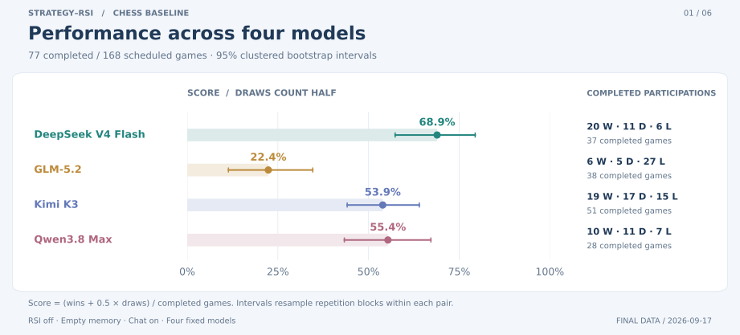
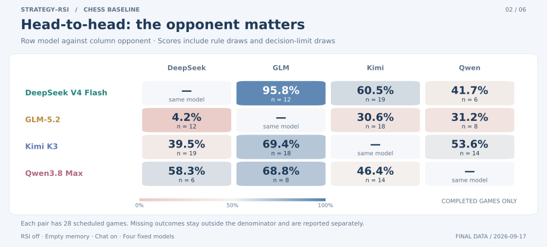

<p align="center">
  
</p>

<h1 align="center">Strategy-RSI</h1>
<p align="center"><strong>Study agent decisions and experience reuse across four games</strong></p>
<p align="center">A multi-agent research platform for Recursive Self-Improvement (RSI)<br />Sanguosha · Werewolf · Chess · Xiangqi</p>
<p align="center">
  <a href="README.md">简体中文</a> · <strong>English</strong>
</p>
<p align="center">
  
</p>
<p align="center">
  <a href="#games">Four games</a> · <a href="#quick-start">Quick start</a> · <a href="#features">Platform features</a> · <a href="#experience-loop">RSI</a> · <a href="#architecture">Architecture</a> · <a href="#experiments">Experiments</a> · <a href="#documentation">Docs</a>
</p>

---

Strategy-RSI uses Sanguosha, Werewolf, Chess and Xiangqi to study how agents collect and use experience from play. Run models against one another, inspect their actions, conversations and reviews, then export the records to test whether experience improves later decisions. The games share model and RSI services, with separate rules and player visibility.

Choose a game in the lobby, or search by its Chinese or English name. Return there to switch games. Each game remembers the selected match, round, replay position and spectator perspective.

[](docs/assets/game-lobby.png)

<a id="games"></a>

## Four games, four strategy environments

Each game has its own spectator interface and supports agent communication, immediate / post-game RSI, consolidation and experience reuse. Click a screenshot to view the original.

<table>
  <tr>
    <td width="50%" valign="top">
      <h3>Sanguosha · 三国杀</h3>
      <p><strong>2–8 players · Chinese · Hidden roles and cards</strong></p>
      <a href="docs/assets/sanguosha-arena.png"></a>
      <p>Players manage their hands and infer allegiances from actions and speech. Configurable roles, basic generals and public chat let researchers examine how models identify allies, spend card resources and reuse experience. Two-player games use simplified Lord-versus-Rebel rules.</p>
      <p><a href="docs/RULES.md">Implemented rules and generals (Chinese) →</a></p>
    </td>
    <td width="50%" valign="top">
      <h3>Werewolf · 狼人杀</h3>
      <p><strong>6–12 players · English / Chinese · Social deduction</strong></p>
      <a href="docs/assets/werewolf-arena.en.png"></a>
      <p>Wolves, a seer, a witch, a hunter and villagers play through night actions, daytime discussion and exile votes until a faction wins. Wolves can talk privately at night. Speech and voting records let researchers examine deception detection, trust and team play.</p>
      <p><a href="docs/games/werewolf.en.md">English rules</a> · <a href="docs/games/werewolf.md">中文规则</a></p>
    </td>
  </tr>
  <tr>
    <td width="50%" valign="top">
      <h3>Chess · 国际象棋</h3>
      <p><strong>2 players · English / Chinese · Perfect information</strong></p>
      <a href="docs/assets/chess-arena.en.png"></a>
      <p>Supports standard moves, including castling, en passant and promotion, plus checkmate, draw offers and repetition rules. Players can speak with each move. Game reviews can be used to study position evaluation, long-term planning and experience reuse.</p>
      <p><a href="docs/games/chess.en.md">English rules and implementation boundaries</a> · <a href="docs/games/chess.md">中文规则</a></p>
    </td>
    <td width="50%" valign="top">
      <h3>Xiangqi · 中国象棋</h3>
      <p><strong>2 players · Chinese · Perfect information</strong></p>
      <a href="docs/assets/xiangqi-arena.png"></a>
      <p>Supports standard moves, checkmate, stalemate losses and perpetual-check losses. Players can speak with each move, and experiments can examine general safety and piece coordination. Complex tournament chasing rules are not implemented; see the rule guide for the supported scope.</p>
      <p><a href="docs/games/xiangqi.md">Moves and laboratory rules (Chinese) →</a></p>
    </td>
  </tr>
</table>

Choose a language when creating a Werewolf or Chess match. The game interface, rules and agent decision / communication / RSI prompts use that language. The shared lobby, player library and some administration controls remain Chinese. Sanguosha and Xiangqi are currently Chinese-only.

Screenshots show the current application running isolated local policy demonstrations, with positions produced by the rules engines. They are interface examples, not model evaluation results. [Screenshot sources and reproduction](docs/MEDIA.md) · [Game catalog](docs/games/README.md) · [Navigation and spectating](docs/ARENA_UI.md)

<a id="quick-start"></a>

## Quick start

Install **Node.js ≥ 22.13**:

```bash
git clone https://github.com/Liuziyu77/Strategy-RSI.git
cd Strategy-RSI
npm ci
npm run dev
```

Open [http://localhost:3930](http://localhost:3930), choose any game and click **运行本地演示 (Run local demo)** to watch local policy agents play without an API key. If a project-local Node runtime is already available, use `./run.sh dev`.

All four games use the same model setup flow:

1. Create players in **玩家库 (Player Library)** and set their names, model connections and RSI modes.
2. Enter a game and create a match. Choose the language, players, number of games, concurrency and chat settings.
3. Follow actions and conversations live or in replay, and inspect reflections in the memory panel. Later matches of the same game can read that experience.

Model services must support `POST /v1/chat/completions`. Configure individual connections in the player library or a shared service through [.env.example](.env.example). [Detailed setup and model integration guide →](docs/GETTING_STARTED.md)

<details>
<summary><strong>Production use and data storage</strong></summary>

```bash
npm run build
npm start
```

Data is stored in `data/arena.sqlite` by default. After a restart, unfinished matches return paused and can resume from their checkpoints. Configuration includes `DATA_DIR`, `PORT`, `HOST` and `ARENA_ADMIN_TOKEN`; use one server process per data directory. See [migration instructions](docs/MIGRATION.md) for backups and upgrades.

</details>

<a id="features"></a>

## Shared platform features

| Capability                              | How it works                                                                                                                                                                               |
| --------------------------------------- | ------------------------------------------------------------------------------------------------------------------------------------------------------------------------------------------ |
| **Multiple models and external agents** | Configure each player's model, connection and RSI independently, or use local policies and external agents over HTTP.                                                                      |
| **Rule-aware communication**            | Sanguosha and both chess games support optional public speech; Werewolf separates public daytime discussion from private wolf-team chat. Visibility applies to both decisions and reviews. |
| **Persistent experience**               | Manage reflections, reviews, manual entries and summaries together. Memory is scoped by **Agent ID × game type**; Chinese and English variants of the same game share it.                  |
| **Concurrent experiments**              | Each match can contain multiple games with configurable concurrency; progress, outcomes and call records are stored separately for each game.                                              |
| **Spectating and replays**              | Separate themes, spectator perspectives, board flipping, frame-by-frame replay and view restoration when switching games.                                                                  |
| **Tracing and analysis**                | Per-match win rates, durations and round counts, model call / retry / fallback records, and JSON / JSONL exports.                                                                          |

Models read the board or hand as JSON text, alongside the player's visible state, legal actions, history, conversation and personal experience. They return an action ID and optional speech for the rules engine to validate and execute. Screenshots are only used for spectating. [Input formats and API examples →](docs/API.md)

<a id="experience-loop"></a>

## RSI: from play to the next decision


| Mode                 | When experience is generated                                                                            |
| -------------------- | ------------------------------------------------------------------------------------------------------- |
| **Immediate RSI**    | After an action involving a choice, assess and record reusable lessons.                                 |
| **Post-game RSI**    | Review the completed game; store reviews separately from immediate reflections.                         |
| **Both modes**       | Enable action reflection and post-game review together.                                                 |
| **New RSI disabled** | Stop generating reflections while still reading existing experience, for evaluation with frozen memory. |

Experience is organized by player, match, source game and type. The player's current model consolidates and deduplicates it. Later decisions prioritize the latest valid summary and add uncovered entries; originals and historical versions remain available. Experience collected by the same agent in concurrent games can inform its later decisions within that game type.

RSI saves text reflections as memory and adds them to later decision contexts; it does not train model weights. Evaluate it by comparing empty-memory, frozen-memory and ongoing-RSI conditions, controlling opponents, seats, seeds and call failures. [Experiment design and available reports →](exp/README.md)

<a id="architecture"></a>

## Architecture and extension

Game plugins handle rules, visible information, legal actions, outcomes and state restoration. Shared services handle model calls, communication, RSI, memory, scheduling and persistence. To add a game, implement `GamePlugin` and register its metadata and frontend view.

```text
web/          Game lobby, separate rooms, player library and replays
server/       Models, communication, RSI, consolidation, scheduling and SQLite
src/games/    Common contracts, catalog, registry and new game engines
src/          Sanguosha engine and shared protocol types
tests/        Game rules, server integration and browser validation
exp/          Reports, per-game analysis, data and figures
```

[Multi-game architecture](docs/MULTIGAME_ARCHITECTURE.md) · [Runtime details](docs/ARCHITECTURE.md) · [Adding a game](docs/EXTENDING_GAMES.md)

<a id="experiments"></a>
<a id="demos"></a>

## Experiments and research progress

Reports are organized by game. Werewolf, Chess and Xiangqi each have **168 scheduled baseline games**, staying within **200 games per game type** after pilots and functionality checks. Sanguosha keeps its earlier **528-game study**. All baselines use empty memory with RSI off. Separate checks cover communication and RSI functionality; they do not measure learning benefits.

| Game                                  | Baseline | Completed | Errors | Including pilots/checks / cap |
| ------------------------------------- | -------- | --------- | ------ | ----------------------------- |
| [Werewolf](exp/werewolf/README.en.md) | 168      | 156       | 12     | 176 / 200                     |
| [Chess](exp/chess/README.en.md)       | 168      | 77        | 91     | 180 / 200                     |
| [Xiangqi](exp/xiangqi/README.en.md)   | 168      | 73        | 95     | 175 / 200                     |

<details>
<summary><strong>Werewolf: 168 games and six figures</strong></summary>

The 24 initial and 144 additional games ended as follows: rule wins 156, rule draws 0, action-limit draws 0, errors 12.

| Model    | W / D / L | Completed participations | Team win rate |
| -------- | --------- | ------------------------ | ------------- |
| DeepSeek | 172/0/140 | 312                      | 55.1%         |
| GLM      | 171/0/141 | 312                      | 54.8%         |
| Kimi     | 175/0/137 | 312                      | 56.1%         |
| Qwen     | 170/0/142 | 312                      | 54.5%         |

<table>
  <tr>
    <td width="50%" valign="top">
      <a href="exp/werewolf/assets/win-rate.svg"></a>
    </td>
    <td width="50%" valign="top">
      <a href="exp/werewolf/assets/role-win-rate.svg"></a>
    </td>
  </tr>
</table>

Each of the 21 role seeds is used with four model rotations and both languages. Every model has two seats per game. Analysis groups results by role seed to account for related seats.

[Full report, RSI checks and six figures](exp/werewolf/README.en.md) · [results.json](exp/werewolf/results.json) · [plan.json](exp/werewolf/plan.json)

</details>

<details>
<summary><strong>Chess: 168 games and six figures</strong></summary>

The 24 initial and 144 additional games ended as follows: rule wins 55, rule draws 21, action-limit draws 1, errors 91.

| Model    | W / D / L | Completed participations | Score |
| -------- | --------- | ------------------------ | ----- |
| DeepSeek | 20/11/6   | 37                       | 68.9% |
| GLM      | 6/5/27    | 38                       | 22.4% |
| Kimi     | 19/17/15  | 51                       | 53.9% |
| Qwen     | 10/11/7   | 28                       | 55.4% |

<table>
  <tr>
    <td width="50%" valign="top">
      <a href="exp/chess/assets/win-rate.svg"></a>
    </td>
    <td width="50%" valign="top">
      <a href="exp/chess/assets/head-to-head.svg"></a>
    </td>
  </tr>
</table>

Score is `(wins + 0.5 × draws) / completed participations`. Games repeat the standard starting position with colors exchanged. Results describe completed games from these starts; failed games may bias the comparison.

[Full report, RSI checks and six figures](exp/chess/README.en.md) · [results.json](exp/chess/results.json) · [plan.json](exp/chess/plan.json)

</details>

<details>
<summary><strong>Xiangqi: 168 games and six figures</strong></summary>

The 24 initial and 144 additional games ended as follows: rule wins 43, rule draws 26, action-limit draws 4, errors 95.

| Model    | W / D / L | Completed participations | Score |
| -------- | --------- | ------------------------ | ----- |
| DeepSeek | 21/6/2    | 29                       | 82.8% |
| GLM      | 3/9/18    | 30                       | 25.0% |
| Kimi     | 10/22/9   | 41                       | 51.2% |
| Qwen     | 9/23/14   | 46                       | 44.6% |

<table>
  <tr>
    <td width="50%" valign="top">
      <a href="exp/xiangqi/assets/win-rate.svg"></a>
    </td>
    <td width="50%" valign="top">
      <a href="exp/xiangqi/assets/head-to-head.svg"></a>
    </td>
  </tr>
</table>

Score is `(wins + 0.5 × draws) / completed participations`. Games repeat the standard starting position with colors exchanged. Results describe completed games from these starts; failed games may bias the comparison.

[Full report, RSI checks and six figures](exp/xiangqi/README.en.md) · [results.json](exp/xiangqi/results.json) · [plan.json](exp/xiangqi/plan.json)

</details>

<details>
<summary><strong>Explore the Sanguosha results: four models, six figures and key findings</strong></summary>

### Experiment overview

Results were compiled on **September 14, 2026**. DeepSeek, GLM, Kimi and Qwen all use Guan Yu and empty memory, with **RSI off and public chat on**. Duels mirror roles and seats; four-player identity games cover every seat permutation. **233 / 240** duels and **256 / 288** four-player games completed normally. Full API model labels, settings and statistical methods are in the [experiment report](exp/sanguosha/README.en.md).

| Model    | Four-player wins / normal participations | Four-player win rate |
| -------- | ---------------------------------------: | -------------------: |
| DeepSeek |                                158 / 256 |            **61.7%** |
| GLM      |                                 74 / 256 |                28.9% |
| Kimi     |                                 86 / 256 |                33.6% |
| Qwen     |                                 78 / 256 |                30.5% |

Win rates include only normally completed games. Identity games use team outcomes, so multiple players can win together. DeepSeek's four-player differences from all three opponents remain supported after correcting for multiple comparisons; the other three cannot be reliably ranked against one another.

### Results and figures

All six figures use the same dimensions. Click a figure to view the original.

<table>
  <tr>
    <td width="50%" valign="top">
      <h4>Win rate</h4>
      <a href="exp/sanguosha/assets/win-rate.svg"></a>
      <p>Duels and four-player identity games are measured separately. Error bars show 95% seed-block confidence intervals.</p>
    </td>
    <td width="50%" valign="top">
      <h4>Head-to-head</h4>
      <a href="exp/sanguosha/assets/head-to-head.svg"></a>
      <p>DeepSeek finishes <strong>20 : 19</strong> against GLM and <strong>28 : 12</strong> against Kimi; performance varies with the opponent.</p>
    </td>
  </tr>
  <tr>
    <td width="50%" valign="top">
      <h4>Role win rate</h4>
      <a href="exp/sanguosha/assets/role-win-rate.svg"></a>
      <p>DeepSeek has the highest point estimate in all four roles. Equal role weighting leaves its win rate at <strong>61.6%</strong>.</p>
    </td>
    <td width="50%" valign="top">
      <h4>Game duration</h4>
      <a href="exp/sanguosha/assets/game-duration.svg"></a>
      <p>Median duration is <strong>12.1 minutes</strong> for duels and <strong>36.2 minutes</strong> for four-player games, including queues and retries but excluding documented account-recovery waits.</p>
    </td>
  </tr>
  <tr>
    <td width="50%" valign="top">
      <h4>Token use</h4>
      <a href="exp/sanguosha/assets/token-use.svg"></a>
      <p>The experiment reports <strong>428.5M tokens</strong>, with input accounting for <strong>94.1%</strong>. Totals include reported retry usage; providers use different accounting methods.</p>
    </td>
    <td width="50%" valign="top">
      <h4>Chat frequency</h4>
      <a href="exp/sanguosha/assets/chat-frequency.svg"></a>
      <p>In four-player games, GLM speaks in <strong>96.6%</strong> of decisions versus DeepSeek's <strong>82.3%</strong>. More frequent speech does not coincide with more wins here.</p>
    </td>
  </tr>
</table>

This study measures performance without experience and **has not tested RSI benefits or the causal effect of chat**. Findings apply to the tested model labels, generals, rules, prompts and sampled seeds. See the [full analysis](exp/sanguosha/README.en.md#interpreting-the-findings) for failure handling, statistical intervals and limits.

[Summary data](exp/sanguosha/results.json) · [Duel actions and chat](exp/sanguosha/games-history-duel.json) · [Four-player actions and chat](exp/sanguosha/games-history-identity.json) · [Figure reproduction](exp/sanguosha/README.en.md#data-and-reproduction)

</details>

[Experiment index and design notes](exp/README.md) · [Full Sanguosha report and six figures](exp/sanguosha/README.en.md) · [Data and reproduction](exp/sanguosha/README.en.md#data-and-reproduction) · [Archived demos and videos](docs/MEDIA.md#sanguosha-demos)

<a id="documentation"></a>

## Documentation

| Goal                                           | Start here                                                                          |
| ---------------------------------------------- | ----------------------------------------------------------------------------------- |
| Find guides, terminology and language coverage | [Documentation index](docs/README.md)                                               |
| Run the app, configure models and matches      | [Setup](docs/GETTING_STARTED.md) · [HTTP API](docs/API.md)                          |
| Learn the games and spectator controls         | [Game catalog](docs/games/README.md) · [Arena guide](docs/ARENA_UI.md)              |
| Add games and maintain themes                  | [Extension guide](docs/EXTENDING_GAMES.md) · [Visual design](docs/VISUAL_DESIGN.md) |
| Upgrade stored data and review limitations     | [Migration](docs/MIGRATION.md) · [Dated quality review](docs/QUALITY_REVIEW.md)     |
| Reproduce studies or refresh media             | [Experiment index](exp/README.md) · [Screenshots and recordings](docs/MEDIA.md)     |

Werewolf and Chess rules, the extension guide and all four experiment reports are available in English. The game catalog, experiment index and architecture also include English guidance. Setup and shared administration documentation are primarily Chinese.

<details>
<summary><strong>Development and validation</strong></summary>

```bash
npm run typecheck
npm test
npm run build
npm run format:check
npx playwright install chromium
npm run test:e2e
```

Rules and integration tests cover gameplay, information isolation, model protocols, recovery, RSI and consolidation; browser tests cover desktop and mobile interactions. Routine tests use temporary data and local mock models. Refresh README screenshots with `npm run build && npm run docs:previews`; see the [media guide](docs/MEDIA.md).

</details>

<a id="news"></a>

<details>
<summary><strong>Release notes</strong></summary>

- **2026.09.17** — Expanded each new game to 168 baseline games, with independent reports, clustered analyses, histories and six matching figures per game.
- **2026.09.16** — Published 72 baseline games for Werewolf, Chess and Xiangqi, real-model RSI checks, six figures and reproduction scripts.
- **2026.09.16** — Expanded to four games with Werewolf, Chess and Xiangqi, a dedicated lobby, separate themes and game-scoped memory.
- **2026.09.14** — Published the Sanguosha four-model baseline, summary data, six figures and reproduction scripts.
- **2026.09.11** — Initial release with Sanguosha spectating, a player library, concurrent games, communication and RSI.

</details>

<a id="todo-list"></a>

<details>
<summary><strong>Next directions</strong></summary>

- Improve experience selection and consolidation, with support for revising stored lessons.
- Add Sanguosha generals, skill descriptions and the corresponding rules.

</details>

## License and acknowledgments

Licensed under [Apache License 2.0](LICENSE). The Sanguosha environment draws on the basic functionality and rules design of [wmzy/sanguosha](https://github.com/wmzy/sanguosha), with a reimplemented state machine, server protocol and frontend, without its images, sound effects or general artwork. Chess uses `chess.js` for move validation. See [THIRD_PARTY_NOTICES.md](THIRD_PARTY_NOTICES.md) for source and license notes.

<p align="center"><sub>Strategy-RSI · Play. Observe. Reflect.</sub><br /><a href="#strategy-rsi">Back to top ↑</a></p>
