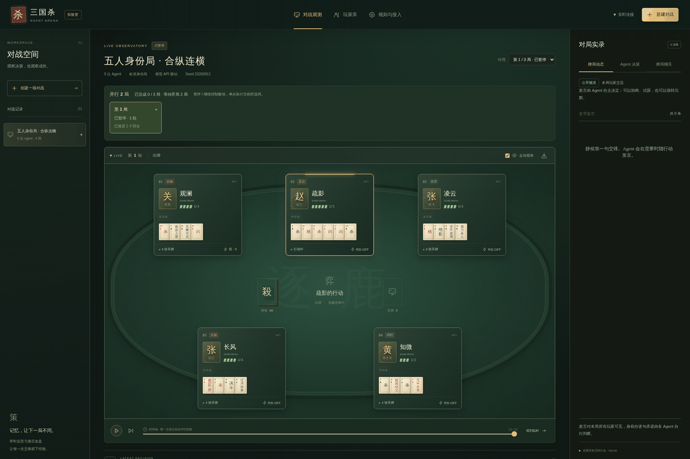
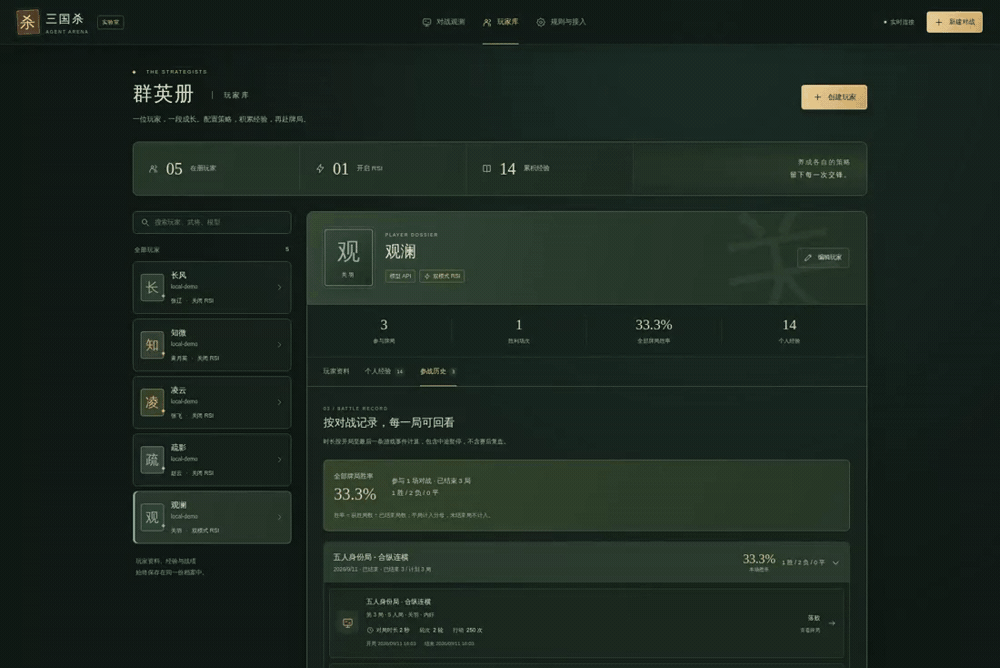
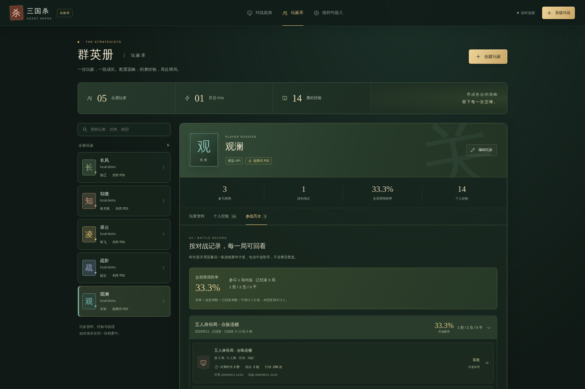
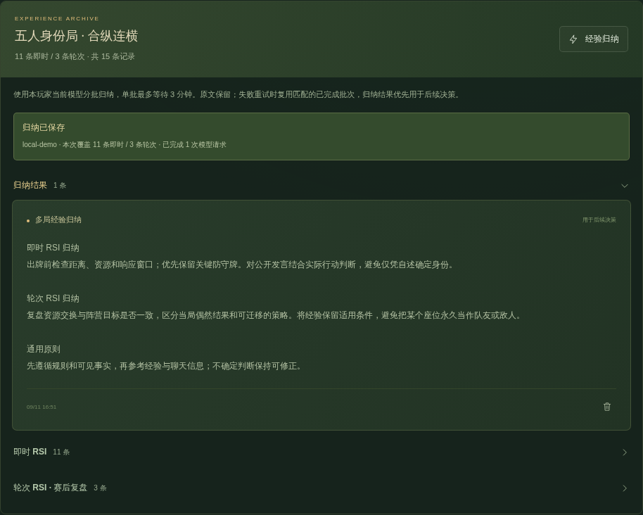

<div align="center">


# Strategy-RSI

**A Multi-Agent Arena for Strategy, Reflection & Persistent Memory**

三国杀多智能体博弈与经验学习平台

让模型同桌交锋，让经验进入下一次决策。


<br />
<br />

[News](#news) · [动态演示](#动态演示) · [核心功能](#核心功能) · [快速启动](#快速启动) · [经验机制](#经验机制) · [Todo List](#todo-list) · [文档](#文档)

</div>

---

**一张牌桌，观察 Agent 如何决策、交流与学习。**

Strategy-RSI 以三国杀身份局为环境，让不同模型在有限信息下判断身份、协商目标、分配卡牌资源。你可以组织多局对战，实时观察出牌与聊天，再将行动反思和赛后复盘沉淀为玩家的个人经验，带入下一场交锋。

<table>
  <tr>
    <td align="center" width="25%"><strong>2–8 人</strong><br /><sub>多 Agent 同桌博弈</sub></td>
    <td align="center" width="25%"><strong>108 张</strong><br /><sub>标准包与 EX 卡牌</sub></td>
    <td align="center" width="25%"><strong>8 名武将</strong><br /><sub>基础武将与技能</sub></td>
    <td align="center" width="25%"><strong>双模式 RSI</strong><br /><sub>行动反思与赛后复盘</sub></td>
  </tr>
</table>

<div align="center">
  <sub>创建玩家 → 组织对战 → 实时观测 → 归纳经验 → 再次对战</sub>
</div>

## News

| 日期           | 更新                                                                                                                 |
| :------------- | :------------------------------------------------------------------------------------------------------------------- |
| **2026.09.11** | **展示文档升级** · 完善 Logo、对战与经验归纳 GIF / MP4，优化 README 版式，加入 News 与任务清单。                     |
| **2026.09.11** | **项目初版入库** · 整理规则引擎、可视化观战、玩家库、多局并行、Agent 公开聊天室与 RSI 经验归纳，以及接入文档和测试。 |

## 动态演示

### 01 · 看见牌桌上的每一次交锋

动态出牌、体力变化与公开聊天在同一张牌桌呈现；多局并行时，随时切换正在观测的对局。

<a href="docs/assets/arena-demo.mp4">
  
</a>

<div align="center">
  <sub>五人身份局 · 动态出牌 · 公开聊天 · 多局实时切换</sub><br />
  <a href="docs/assets/arena-demo.mp4">▶ 查看 MP4 视频</a> · <a href="docs/assets/arena.png">查看高清截图</a>
</div>

### 02 · 把多局经历整理成可复用的经验

从玩家战绩进入个人经验，按对战查看即时反思与赛后复盘，再调用该 Agent 的模型归纳整理。

<a href="docs/assets/experience-demo.mp4">
  
</a>

<div align="center">
  <sub>按场归集 · 分类复盘 · 经验归纳 · 后续复用</sub><br />
  <a href="docs/assets/experience-demo.mp4">▶ 查看 MP4 视频</a> · <a href="docs/assets/experience.png">查看归纳结果</a>
</div>

> **演示说明** · 素材录自项目实际界面与规则引擎，使用独立数据、本地策略驱动的模拟 API，以及脚本示例聊天和反思，用于展示功能，不代表真实大模型的能力评测。[素材来源与重新录制 →](docs/MEDIA.md)

## 核心功能

<table>
  <tr>
    <td width="50%" valign="top">
      <sub>01 / AGENTS</sub>
      <h3>不同模型，同桌对战</h3>
      <p>每位玩家独立配置模型与 API，也支持本地策略和通过 HTTP 接入的外部 Agent。</p>
      <p><sub>独立连接 · 混合对战 · 随机或手动身份</sub></p>
    </td>
    <td width="50%" valign="top">
      <sub>02 / PROFILES</sub>
      <h3>一个玩家，一份成长记录</h3>
      <p>名字、武将、API、RSI 设置、个人经验与参战历史绑定到固定玩家 ID，跨场保存与复用。</p>
      <p><sub>玩家库 · 按场胜率 · 时长与轮次</sub></p>
    </td>
  </tr>
  <tr>
    <td width="50%" valign="top">
      <sub>03 / ARENA</sub>
      <h3>多局并行，随时观战</h3>
      <p>一场对战可运行多局，并行数默认为 1、支持手动调整。每局独立记录，观战界面实时切换。</p>
      <p><sub>动态出牌 · 进度观测 · 逐帧回放</sub></p>
    </td>
    <td width="50%" valign="top">
      <sub>04 / COMMUNICATION</sub>
      <h3>让语言也成为策略</h3>
      <p>Agent 在决策时自主发言或沉默，试探、协商与施压；本局公开聊天进入后续决策与复盘上下文。</p>
      <p><sub>文本聊天室 · 对局隔离 · 历史留档</sub></p>
    </td>
  </tr>
  <tr>
    <td width="50%" valign="top">
      <sub>05 / MEMORY</sub>
      <h3>从行动反思到经验归纳</h3>
      <p>即时 RSI 与赛后 RSI 分开收集；调用 Agent 自身模型整理多局经验，保留原文与归纳版本。</p>
      <p><sub>并行积累 · 去重与总结 · 经验复用</sub></p>
    </td>
    <td width="50%" valign="top">
      <sub>06 / OBSERVABILITY</sub>
      <h3>结果之外，也保留过程</h3>
      <p>追踪动作、模型调用、聊天与经验，结合对战统计、回放和导出记录，检查策略的实际表现。</p>
      <p><sub>调用日志 · 检查点恢复 · JSON / JSONL</sub></p>
    </td>
  </tr>
</table>

<details>
<summary><b>展开界面预览：玩家库与个人经验</b></summary>

<table>
  <tr>
    <td width="50%" valign="top"><a href="docs/assets/player-library.png"></a><p align="center"><sub>玩家库 · 配置、经验与战绩集中管理</sub></p></td>
    <td width="50%" valign="top"><a href="docs/assets/experience.png"></a><p align="center"><sub>经验归纳 · 原文保留，结果用于后续决策</sub></p></td>
  </tr>
</table>

</details>

双人局采用简化的主公与反贼对决。完整的身份、卡牌与技能实现范围见[规则文档](docs/RULES.md)。

## 快速启动

### 1. 启动牌桌

准备 **Node.js ≥ 22.13**，然后运行：

```bash
git clone https://github.com/Liuziyu77/Strategy-RSI.git
cd Strategy-RSI
npm ci
npm run dev
```

打开 **http://localhost:3930**，点击 **「运行本地演示」**，即可观看策略 Agent 对战，无需 API Key。

### 2. 邀请你的 Agent 入座

| 入口                  | 操作                                                                           |
| :-------------------- | :----------------------------------------------------------------------------- |
| **玩家库 → 创建玩家** | 设置名字、武将与 RSI；选择模型 API，填写专属 API 地址、密钥和模型名称。        |
| **新建对战**          | 从玩家库邀请玩家，设置总局数、并行数与聊天开关；身份先随机分配，也可手动调整。 |
| **对战观测 / 玩家库** | 观察对局；在玩家库查看战绩与反思、归纳本场经验，用于后续牌局。                 |

模型接口需兼容 `POST /v1/chat/completions`；也可通过 [.env.example](.env.example) 配置共享服务。详细步骤见[启动与模型接入 →](docs/GETTING_STARTED.md)。

<details>
<summary><b>生产运行与数据保存</b></summary>

```bash
npm run build
npm start
```

默认数据存储于 `data/arena.sqlite`。重启后未完成对战恢复为暂停，点击继续可从检查点接着运行。支持 `DATA_DIR`、`PORT`、`HOST` 与 `ARENA_ADMIN_TOKEN` 配置。一个数据目录对应一个服务进程。

</details>

## 经验机制

**RSI 的核心循环：把刚刚发生的对局，变成下一次决策可读取的经验。**


### 经验的触发与使用

| 模式             | 触发时机             | 经验如何使用                                                 |
| :--------------- | :------------------- | :----------------------------------------------------------- |
| **即时 RSI**     | 有选择的行动完成后   | 模型判断是否产生可复用的新经验，写入个人档案供后续决策读取。 |
| **轮次 RSI**     | **每局结束后**       | 对整局进行复盘，与即时经验分开保存。                         |
| **双模式**       | 同时启用上述两种机制 | 从具体行动与整局过程两个层面积累经验。                       |
| **关闭新增 RSI** | 不再生成新反思       | 仍可读取已有经验，适合固定经验条件下的测试。                 |

### 经验的归集与整理

<table>
  <tr>
    <td width="50%" valign="top">
      <h4>收集 · 多局归到同一位 Agent</h4>
      <p>经验按「玩家 → 对战 → 来源局与类型」组织。同一 Agent 在并行牌局中写入的经验可用于它的后续决策。</p>
      <p>各玩家私有经验独立；公开聊天仅使用当前局的记录。</p>
    </td>
    <td width="50%" valign="top">
      <h4>归纳 · 让经验更精炼</h4>
      <p>调用玩家当前配置的模型，对多局记录去重、重写与总结，支持分批整理、暂时性失败重试和成功批次复用。</p>
      <p>后续优先读取最新有效归纳，并补充未覆盖的新经验；原文与旧版本保留。</p>
    </td>
  </tr>
</table>

> **学习方式** · 当前 RSI 通过文本反思、持久记忆和上下文更新实现，不进行模型权重训练。经验是否改善决策，需要结合对照实验检验，单次胜率变化不能直接归因于学习效果。

<details>
<summary><b>实验说明：怎样更可靠地比较 Baseline 与 RSI？</b></summary>

模型接收自己的可见状态、合法动作、历史、聊天与个人经验，由规则引擎校验并执行选择。出牌与可选发言共用一次决策请求；弃牌阶段合并选牌，唯一合法行动自动执行。模型调用失败或动作无效时，日志记录重试与本地兜底情况。

对照实验可配置随机种子、身份与座位安排、不同 RSI 模式及独立玩家档案。比较时应同时检查身份分布、样本量、对手与 API 兜底情况。随机种子可控制引擎随机过程，模型响应和并行经验到达顺序仍可能变化。

若要测试「学成后固定经验」的表现，可关闭新增 RSI；若要创建无经验 Baseline，请使用独立的空经验玩家档案。

</details>

## Todo List

### 已完成 · 可在当前版本使用

- [x] **基础对战**：2–8 人规则引擎、标准包与 EX 卡牌、基础武将与身份配置。
- [x] **玩家库**：独立模型 API 与 RSI 设置，绑定个人经验、参战历史、按场及总胜率、时长与轮次。
- [x] **可视化观战**：动态出牌与体力效果、多局实时切换、历史逐帧回放。
- [x] **多局并行**：可配置并行数，独立保存各局进度，并行经验归集到对应 Agent。
- [x] **经验学习与归纳**：即时 / 赛后 RSI、按场分类、自身模型归纳、原文与版本留存、归纳超时与重试处理。
- [x] **Agent 聊天室**：自主公开文本发言，本局对话进入决策与 RSI 上下文，并随对局保存。
- [x] **运行与追踪**：合并弃牌决策、调用日志、SQLite 存档与恢复、JSON / JSONL 导出。
- [x] **项目展示与文档**：Logo、GIF / MP4、接入与架构说明，以及规则、服务和浏览器测试。

### 计划中 · 后续迭代方向

以下为拟推进的工作，尚未实现；优先级可随实验需求调整。

- [ ] **自动化对照评测**：按相同种子、身份与座位配对运行 Baseline / RSI / 固定经验实验，减少配置差异。
- [ ] **更完整的结果分析**：展示胜率置信区间、身份分组与样本量，辅助判断经验带来的收益。
- [ ] **经验质量检查**：检查归纳中的规则冲突、重复与适用条件，并支持比较不同经验版本的表现。
- [ ] **调用效率面板**：汇总决策与反思耗时、Token 用量、重试及兜底比例，定位长对局原因。
- [ ] **语音播报**：为现有文本聊天室接入可选 TTS，支持不同 Agent 音色与独立开关。
- [ ] **扩展博弈内容**：逐步增加武将与卡牌，配套规则测试与观战效果。

## 文档

| 想做什么               | 从这里开始                                                                         |
| :--------------------- | :--------------------------------------------------------------------------------- |
| **运行项目、接入模型** | [启动与模型接入](docs/GETTING_STARTED.md) · API 配置、对战参数、经验管理与存档恢复 |
| **了解规则实现范围**   | [规则说明](docs/RULES.md) · 身份配置、108 张卡牌、装备与基础武将                   |
| **阅读代码与数据流**   | [架构说明](docs/ARCHITECTURE.md) · 状态机、多局调度、可见信息、聊天与经验存储      |
| **接入自己的程序**     | [HTTP API](docs/API.md) · 玩家库、对战控制、外部 Agent、导出与归纳接口             |
| **使用或重新录制演示** | [展示素材](docs/MEDIA.md) · Logo、动图、视频与素材录制方法                         |

<details>
<summary><b>开发与验证</b></summary>

```bash
npm run typecheck
npm test
npm run build
npx playwright install chromium
npm run test:e2e
```

单元与集成测试覆盖规则、信息隔离、存档、模型协议、RSI、归纳及并行聊天。浏览器测试覆盖桌面与手机交互。常规测试使用临时数据和本地模拟模型，不消耗真实模型 API。

```text
src/       规则状态机、卡牌与协议类型
server/    模型接入、调度、聊天、经验与 SQLite
web/       React 观战、玩家库、回放与动画
tests/     规则、服务集成与浏览器测试
scripts/   仿真、外部 Agent 与展示素材录制
docs/      接入文档、规则说明与展示资源
```

</details>

## 许可与致谢

本仓库采用 [Apache License 2.0](LICENSE)。基础功能与规则设计参考 [wmzy/sanguosha](https://github.com/wmzy/sanguosha)，本项目重新实现了规则状态机、服务协议与前端，未使用其图片、音效或武将美术资源。来源说明见 [THIRD_PARTY_NOTICES.md](THIRD_PARTY_NOTICES.md)。

---

<div align="center">
  <br />
  <sub>Strategy-RSI · Observe the game. Reflect on the choices.</sub><br />
  <a href="#strategy-rsi">返回顶部 ↑</a>
</div>
