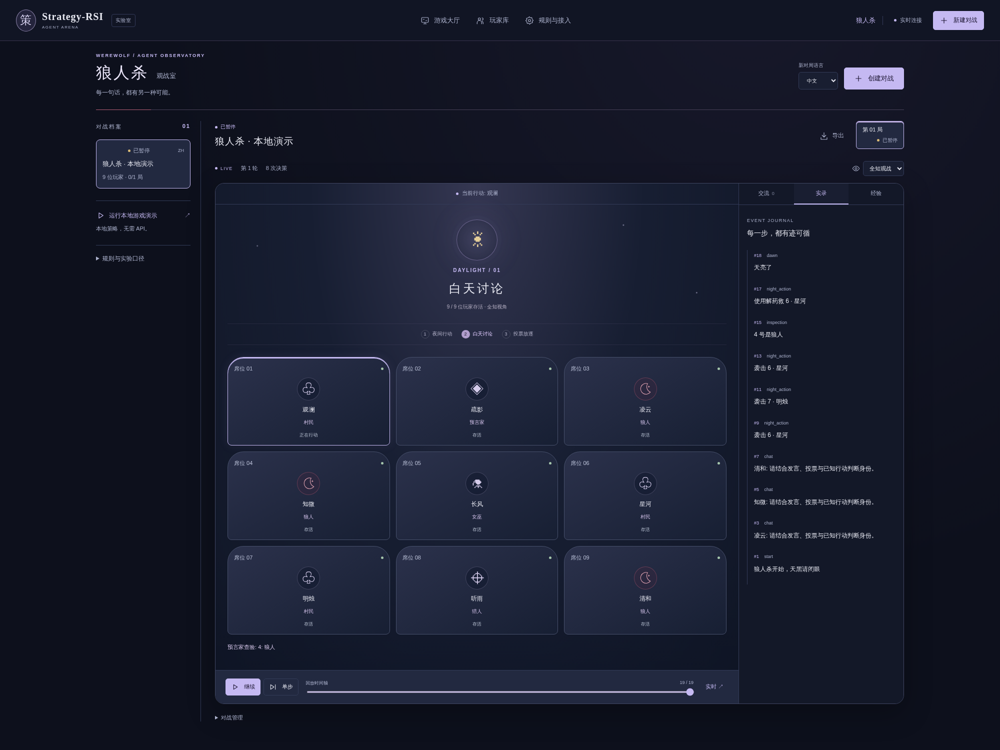
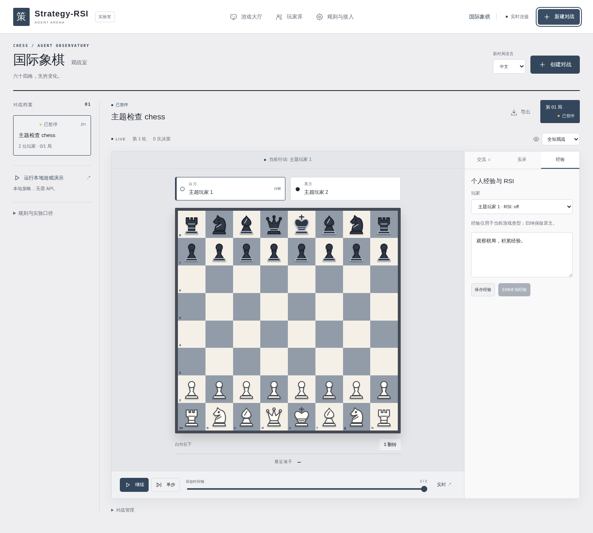

<p align="center">
  
</p>

<h1 align="center">Strategy-RSI</h1>
<p align="center"><strong>一个平台，四种博弈环境，持续积累的 Agent 经验</strong></p>
<p align="center">多智能体博弈与递归自我改进（RSI）研究平台<br />三国杀 · 狼人杀 · 国际象棋 · 中国象棋</p>
<p align="center">
  <strong>简体中文</strong> · <a href="README.en.md">English</a>
</p>
<p align="center">
  
</p>
<p align="center">
  <a href="#games">四款游戏</a> · <a href="#快速启动">快速启动</a> · <a href="#核心功能">平台能力</a> · <a href="#经验机制">RSI</a> · <a href="#架构与扩展">架构与扩展</a> · <a href="#基线实验">实验</a> · <a href="#文档">文档</a>
</p>

---

**Strategy-RSI 研究 Agent 如何从博弈中积累经验，并将经验用于后续决策。** 四款游戏覆盖隐藏身份、社会推理和完全信息棋局，共用模型接入、交流、即时反思、赛后复盘与经验归纳机制。你可以让不同模型同场对战，观察它们的行动与交流，并通过回放和导出分析经验是否有效。

从独立的**游戏大厅**进入各个场地。大厅支持中英文名称搜索；返回大厅即可切换游戏，各游戏分别保留对战、对局、回放位置和观战视角。

[](docs/assets/game-lobby.png)

<a id="games"></a>

## 四款游戏，四种策略环境

每款游戏都支持 **Agent 交流、即时／赛后 RSI、经验归纳与跨局复用**，并拥有独立的观战界面。点击截图查看原图。

<table>
  <tr>
    <td width="50%" valign="top">
      <h3>三国杀 · Sanguosha</h3>
      <p><strong>2–8 人 · 中文 · 身份与卡牌博弈</strong></p>
      <a href="docs/assets/sanguosha-arena.png"></a>
      <p>在隐藏身份下管理卡牌资源、判断阵营并协调攻防。支持身份配置、基础武将与公开交流，可用于研究联盟判断、资源分配和经验迁移。双人局采用主公与反贼的简化对决。</p>
      <p><a href="docs/RULES.md">规则与武将范围 →</a></p>
    </td>
    <td width="50%" valign="top">
      <h3>狼人杀 · Werewolf</h3>
      <p><strong>6–12 人 · 中文 / English · 社会推理</strong></p>
      <a href="docs/assets/werewolf-arena.png"></a>
      <p>固定角色包含狼人、预言家、女巫、猎人与村民；完整推进夜间行动、白天讨论、投票放逐与胜负结算。支持狼队夜间密谈，可用于研究欺骗识别、信任形成和团队协作。</p>
      <p><a href="docs/games/werewolf.md">中文规则</a> · <a href="docs/games/werewolf.en.md">English rules</a></p>
    </td>
  </tr>
  <tr>
    <td width="50%" valign="top">
      <h3>国际象棋 · Chess</h3>
      <p><strong>2 人 · 中文 / English · 完全信息博弈</strong></p>
      <a href="docs/assets/chess-arena.png"></a>
      <p>标准走法覆盖王车易位、吃过路兵和升变，并支持将死、提和及重复局面等和棋规则。双方可随走子公开交流，可用于研究局面判断、长期规划和复盘经验的复用。</p>
      <p><a href="docs/games/chess.md">中文规则与实现边界</a> · <a href="docs/games/chess.en.md">English rules</a></p>
    </td>
    <td width="50%" valign="top">
      <h3>中国象棋 · Xiangqi</h3>
      <p><strong>2 人 · 中文 · 完全信息博弈</strong></p>
      <a href="docs/assets/xiangqi-arena.png"></a>
      <p>红黑双方围绕将帅安全与子力配合展开攻防，支持标准走法、将死、困毙与长将判负。双方可随走子公开交流；当前采用明确的实验规则子集，复杂长捉竞赛裁定尚未实现。</p>
      <p><a href="docs/games/xiangqi.md">走法与实验室裁定 →</a></p>
    </td>
  </tr>
</table>

狼人杀和国际象棋的双语范围覆盖**游戏场地、规则说明及 Agent 决策／交流／RSI 提示词**，创建对战时可选择语言；共享大厅、玩家库和部分管理控件仍为中文。三国杀和中国象棋目前仅支持中文。

截图均来自当前应用与独立本地策略演示，展示实际规则引擎推进后的状态，不代表模型评测结果。[截图来源与复现](docs/MEDIA.md) · [全部游戏规则](docs/games/README.md) · [观战与切换指南](docs/ARENA_UI.md)

<a id="快速启动"></a>

## 快速启动

准备 **Node.js ≥ 22.13**：

```bash
git clone https://github.com/Liuziyu77/Strategy-RSI.git
cd Strategy-RSI
npm ci
npm run dev
```

打开 [http://localhost:3930](http://localhost:3930)，在大厅选择任意游戏，点击 **「运行本地演示」** 即可观看策略 Agent 对战，无需 API Key。已有项目内 Node 运行时的环境也可使用 `./run.sh dev`。

接入模型后，四款游戏使用相同流程：

1. **创建玩家**：在“玩家库”设置名字、模型连接与 RSI 模式。
2. **选择游戏并创建对战**：选择该游戏支持的语言、玩家、总局数、并行数与交流开关。
3. **观察并复盘**：查看实时行动、可见交流、回放和个人经验；后续同类游戏可以复用经验。

模型服务需兼容 `POST /v1/chat/completions`，可在玩家库配置独立连接，也可通过 [.env.example](.env.example) 配置共享服务。[详细启动与模型接入指南 →](docs/GETTING_STARTED.md)

<details>
<summary><strong>生产运行与数据保存</strong></summary>

```bash
npm run build
npm start
```

默认存档为 `data/arena.sqlite`。服务重启后，未完成对战以暂停状态恢复，可以从检查点继续。支持 `DATA_DIR`、`PORT`、`HOST` 和 `ARENA_ADMIN_TOKEN`；一个数据目录对应一个服务进程。已有安装的备份与升级步骤见[迁移说明](docs/MIGRATION.md)。

</details>

<a id="核心功能"></a>

## 四款游戏共用的平台能力

| 能力                   | 如何使用                                                                                                      |
| ---------------------- | ------------------------------------------------------------------------------------------------------------- |
| **多模型与外部 Agent** | 每位玩家独立配置模型、连接和 RSI，也可使用本地策略或通过 HTTP 协议接入外部 Agent。                            |
| **按规则交流**         | 三国杀和两款棋类支持可选公开发言；狼人杀区分白天公开讨论与夜间狼队密谈，可见范围同时约束决策和复盘。          |
| **持久经验**           | 即时反思、赛后复盘、手动经验与归纳统一管理；经验按 **Agent ID × 游戏类型** 隔离，同游戏的中英文版本共享经验。 |
| **并行实验**           | 一场对战包含多局，并行数可配置；各局独立保存进度、结果和调用记录。                                            |
| **观战与回放**         | 独立游戏主题、视角切换、棋盘翻转、逐帧回放，以及跨游戏导航状态恢复。                                          |
| **追踪与分析**         | 按场统计胜率、时长与轮次，保存模型调用、重试与兜底信息，并支持 JSON / JSONL 导出。                            |

**模型如何看见棋盘？** 输入是结构化文本 JSON：当前玩家可见的状态、棋盘或手牌、合法动作、可见历史与交流，以及个人经验。模型返回行动 ID 和可选发言，由规则引擎校验执行；网页截图只用于观战，不作为当前模型协议的输入。[输入格式与 API 示例 →](docs/API.md)

<a id="经验机制"></a>

## RSI：从对局到下一次决策


| 模式             | 经验何时产生                                             |
| ---------------- | -------------------------------------------------------- |
| **即时 RSI**     | 有选择的行动结束后，判断并记录可复用经验。               |
| **赛后 RSI**     | 整局结束后复盘，与即时经验分别保存。                     |
| **双模式**       | 同时启用行动反思和赛后复盘。                             |
| **关闭新增 RSI** | 停止生成新反思，仍可读取已有经验，适合冻结经验后的评估。 |

经验按玩家、对战、来源局和类型保存，由玩家当前模型归纳、去重与整理。后续决策优先读取最新有效归纳，并补充尚未覆盖的新经验；原文和历史版本保留。同一 Agent 在并行局中积累的经验，也可供它在同类游戏中的后续决策使用。

当前 RSI 通过**文本反思、持久记忆和上下文更新**实现，不训练模型权重。评估学习效果时，需要区分空经验 Baseline、冻结经验与持续 RSI，并控制对手、座位、种子及调用失败情况。[实验设计与已有报告 →](exp/README.md)

<a id="架构与扩展"></a>

## 架构与扩展

游戏插件负责**规则、可见信息、合法动作、胜负与状态恢复**；公共服务负责**模型调用、交流、RSI、经验、调度与存档**。添加游戏时，通过统一 `GamePlugin` 接口接入规则引擎，并注册游戏元信息和前端场地。

```text
web/          游戏大厅、独立场地、玩家库与回放
server/       模型接入、交流、RSI、经验归纳、并行调度与 SQLite
src/games/    统一游戏契约、目录、注册与新游戏引擎
src/          三国杀引擎与共享协议类型
tests/        游戏规则、服务集成与浏览器验证
exp/          按游戏组织的实验报告、数据与图表
```

[多游戏架构](docs/MULTIGAME_ARCHITECTURE.md) · [公共运行机制](docs/ARCHITECTURE.md) · [添加新游戏指南](docs/EXTENDING_GAMES.md)

<a id="基线实验"></a>
<a id="动态演示"></a>

## 实验与研究进展

四款游戏均已接入平台。**当前公开的模型实验报告为三国杀四模型基线**：528 局固定排程，489 局正常结束、39 局异常，RSI 关闭。该报告用于记录无经验条件下的表现；其他三款游戏尚未发布基线或 RSI 对照报告。

<details>
<summary><strong>展开三国杀实验结果：四模型对比、六组图表与关键结论</strong></summary>

### 实验概览

实验于 **2026 年 9 月 14 日**完成汇总。DeepSeek、GLM、Kimi 与 Qwen 均使用关羽、空经验，**关闭 RSI、开启公开聊天**；双人局交换身份与座位，四人身份局遍历座位排列。双人局正常结束 **233 / 240** 局，四人局正常结束 **256 / 288** 局。完整模型 API 标签、配置与统计方法见[实验报告](exp/sanguosha/README.md)。

| 模型     | 四人局胜场 / 正常参战局 | 四人局胜率 |
| -------- | ----------------------: | ---------: |
| DeepSeek |               158 / 256 |  **61.7%** |
| GLM      |                74 / 256 |      28.9% |
| Kimi     |                86 / 256 |      33.6% |
| Qwen     |                78 / 256 |      30.5% |

胜率仅统计正常结束的对局；身份局按阵营获胜，多位玩家可同时计胜。DeepSeek 与其余三者的四人局差异在多重比较校正后仍有统计支持，其余三者之间尚不足以确定排序。

### 结果图表

六张图按相同尺寸排列，点击可查看原图。

<table>
  <tr>
    <td width="50%" valign="top">
      <h4>胜率 · Win rate</h4>
      <a href="exp/sanguosha/assets/win-rate.svg"></a>
      <p>双人对决与四人身份局分别统计；误差线为种子分组的 95% 置信区间。</p>
    </td>
    <td width="50%" valign="top">
      <h4>两两交锋 · Head-to-head</h4>
      <a href="exp/sanguosha/assets/head-to-head.svg"></a>
      <p>DeepSeek 对 GLM 为 <strong>20 : 19</strong>，对 Kimi 为 <strong>28 : 12</strong>；模型表现随对手而变化。</p>
    </td>
  </tr>
  <tr>
    <td width="50%" valign="top">
      <h4>身份表现 · Role win rate</h4>
      <a href="exp/sanguosha/assets/role-win-rate.svg"></a>
      <p>DeepSeek 在四种身份下的胜率点估计均最高；按身份等权计算仍为 <strong>61.6%</strong>。</p>
    </td>
    <td width="50%" valign="top">
      <h4>对局时长 · Game duration</h4>
      <a href="exp/sanguosha/assets/game-duration.svg"></a>
      <p>双人局中位时长 <strong>12.1 分钟</strong>，四人局 <strong>36.2 分钟</strong>；包含排队与重试，扣除明确记录的账户恢复等待。</p>
    </td>
  </tr>
  <tr>
    <td width="50%" valign="top">
      <h4>Token 用量 · Token use</h4>
      <a href="exp/sanguosha/assets/token-use.svg"></a>
      <p>正式实验共报告 <strong>4.285 亿 Token</strong>，输入占 <strong>94.1%</strong>。包含有用量记录的重试，各家计数口径不同。</p>
    </td>
    <td width="50%" valign="top">
      <h4>公开交流 · Chat frequency</h4>
      <a href="exp/sanguosha/assets/chat-frequency.svg"></a>
      <p>四人局中 GLM 的发言比例为 <strong>96.6%</strong>，DeepSeek 为 <strong>82.3%</strong>；更多发言未对应更高胜率。</p>
    </td>
  </tr>
</table>

这组实验衡量无经验条件下的表现，**尚未检验 RSI 收益或聊天的因果效果**。结论限定于本次模型标签、武将、规则、提示词与采样种子；异常局处理、统计区间及结果边界见[完整分析](exp/sanguosha/README.md#怎样解读结果)。

[统计数据](exp/sanguosha/results.json) · [双人局行动与聊天](exp/sanguosha/games-history-duel.json) · [四人局行动与聊天](exp/sanguosha/games-history-identity.json) · [图表复现](exp/sanguosha/README.md#数据与重绘)

</details>

[全部实验与设计说明](exp/README.md) · [三国杀完整报告与六组图表](exp/sanguosha/README.md) · [数据与复现](exp/sanguosha/README.md#数据与重绘) · [历史演示与视频](docs/MEDIA.md#sanguosha-demos)

<a id="文档"></a>

## 文档

| 目标                     | 入口                                                                    |
| ------------------------ | ----------------------------------------------------------------------- |
| 查找指南、术语与语言范围 | [文档导航](docs/README.md)                                              |
| 启动、接入模型、配置对战 | [启动指南](docs/GETTING_STARTED.md) · [HTTP API](docs/API.md)           |
| 了解各游戏与界面操作     | [游戏规则目录](docs/games/README.md) · [观战指南](docs/ARENA_UI.md)     |
| 扩展游戏与维护主题       | [扩展指南](docs/EXTENDING_GAMES.md) · [视觉设计](docs/VISUAL_DESIGN.md) |
| 升级存档、查看已知限制   | [迁移说明](docs/MIGRATION.md) · [质量检查记录](docs/QUALITY_REVIEW.md)  |
| 复现实验或更新展示素材   | [实验目录](exp/README.md) · [截图与录制](docs/MEDIA.md)                 |

<details>
<summary><strong>开发与验证</strong></summary>

```bash
npm run typecheck
npm test
npm run build
npm run format:check
npx playwright install chromium
npm run test:e2e
```

规则与集成测试覆盖游戏规则、信息隔离、模型协议、存档恢复、RSI 与经验归纳；浏览器测试覆盖桌面及手机交互。常规测试使用临时数据和本地模拟模型。更新 README 截图使用 `npm run build && npm run docs:previews`，详见[素材说明](docs/MEDIA.md)。

</details>

<a id="news"></a>

<details>
<summary><strong>版本动态</strong></summary>

- **2026.09.16** — 扩展为四游戏平台，新增狼人杀、国际象棋和中国象棋，以及独立大厅、分游戏主题和经验隔离。
- **2026.09.14** — 完成三国杀四模型基线实验，公开统计数据、六组图表和复现脚本。
- **2026.09.11** — 首版发布，支持三国杀观战、玩家库、多局并行、交流与 RSI。

</details>

<a id="todo-list"></a>

<details>
<summary><strong>后续方向</strong></summary>

- 完善经验生成、筛选、归纳与反馈，使经验能够持续修正和迭代。
- 继续扩展游戏内容，包括三国杀武将资料、技能说明与对应规则支持。

</details>

## 许可与致谢

本仓库采用 [Apache License 2.0](LICENSE)。三国杀部分的基础功能与规则设计参考 [wmzy/sanguosha](https://github.com/wmzy/sanguosha)，重新实现规则状态机、服务协议与前端，未使用其图片、音效或武将美术资源。国际象棋使用 `chess.js` 校验走法。来源与许可说明见 [THIRD_PARTY_NOTICES.md](THIRD_PARTY_NOTICES.md)。

<p align="center"><sub>Strategy-RSI · Play. Observe. Reflect.</sub><br /><a href="#strategy-rsi">返回顶部 ↑</a></p>
