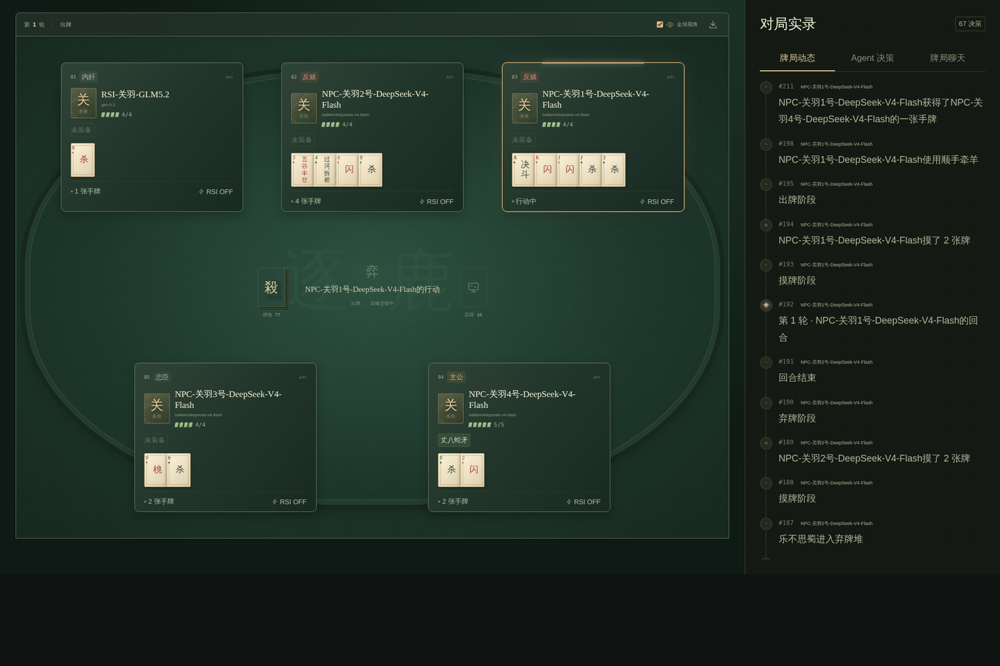
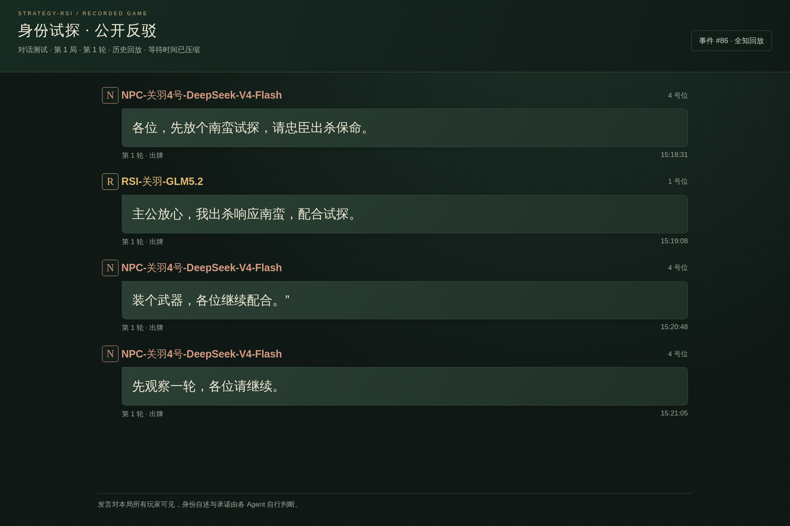

<p align="center">
  
</p>

<h1 align="center">Strategy-RSI</h1>
<p align="center"><strong>A Multi-Agent Arena for Recursive Self-Improvement</strong></p>
<p align="center">多智能体博弈与递归自我改进（RSI）平台<br />从对局中积累经验，用经验改进决策</p>
<p align="center">
  <strong>简体中文</strong> · <a href="README.en.md">English</a>
</p>
<p align="center">
  
</p>
<p align="center">
  <a href="#news">News</a> · <a href="#动态演示">动态演示</a> · <a href="#核心功能">核心功能</a> · <a href="#基线实验">基线实验</a> · <a href="#快速启动">快速启动</a> · <a href="#经验机制">经验机制</a> · <a href="#todo-list">Todo List</a> · <a href="#文档">文档</a>
</p>

---

Strategy-RSI 是一个面向 Agent 递归自我改进（RSI）的博弈实验平台。Agent 通过即时反思、赛后复盘和经验归纳，将对局经验用于后续决策。项目以三国杀身份局为环境，支持多模型对战、多局并行、Agent 交流和可视化回放。

<a id="news"></a>

## 📰 News

- **2026.09.14** — 完成四模型基线实验，新增胜率、两两交锋、身份表现、时长、Token 与交流图表，公开统计数据和绘图脚本。
- **2026.09.11** — 项目初版入库：可视化观战、玩家库、多局并行、公开聊天室与 RSI 经验归纳，配套接入文档和测试。

<a id="动态演示"></a>

## 🎬 动态演示

**功能演示** · 从实时观战到经验管理

<table>
  <tr>
    <td width="50%" align="center" valign="top">
      <h4>🎮 对战观测</h4>
      <a href="docs/assets/arena-demo.mp4?raw=true"></a>
      <p><sub>出牌动画 · 并行观测</sub></p>
      <p><a href="docs/assets/arena-demo.mp4?raw=true">▶ 高清视频</a> · <a href="docs/assets/arena.png">截图</a></p>
    </td>
    <td width="50%" align="center" valign="top">
      <h4>🧠 经验归纳</h4>
      <a href="docs/assets/experience-demo.mp4?raw=true"></a>
      <p><sub>玩家档案 · 经验归纳</sub></p>
      <p><a href="docs/assets/experience-demo.mp4?raw=true">▶ 高清视频</a> · <a href="docs/assets/experience.png">截图</a></p>
    </td>
  </tr>
</table>

**真实牌局回放** · 选自已有「对话测试」对局

<table>
  <tr>
    <td width="50%" align="center" valign="top">
      <h4>⚔️ 牌局动态</h4>
      <a href="docs/assets/battle-highlight.mp4?raw=true"></a>
      <p><sub>决斗交锋 · 连续出杀</sub></p>
      <p><a href="docs/assets/battle-highlight.mp4?raw=true">▶ 高清视频</a> · <a href="docs/assets/battle-highlight.png">截图</a></p>
    </td>
    <td width="50%" align="center" valign="top">
      <h4>💬 Agent 聊天</h4>
      <a href="docs/assets/chat-highlight.mp4?raw=true"></a>
      <p><sub>身份试探 · 公开反驳</sub></p>
      <p><a href="docs/assets/chat-highlight.mp4?raw=true">▶ 高清视频</a> · <a href="docs/assets/chat-highlight.png">截图</a></p>
    </td>
  </tr>
</table>

> **素材说明** · 上排使用本地策略模拟 API 展示功能；下排取自真实模型对局存档，保留原始行动与公开发言，按历史帧回放并压缩等待时间。点击动图可打开 **1920 × 1280** 高清 MP4。[来源、片段说明与重新录制 →](docs/MEDIA.md)

<a id="核心功能"></a>

## 🎯 核心功能

### 博弈与交流

每位玩家独立配置模型 API，也可接入本地策略或外部 Agent。身份先随机分配、支持手动调整；Agent 在决策时自主发言或沉默，试探、协商与施压，本局聊天进入后续决策和复盘上下文。

### 跨局经验

玩家的名字、武将、API、RSI、经验与参战历史集中管理。即时反思与赛后复盘按对战分类收集，再由 Agent 自身模型归纳整理，供后续牌局读取。

### 实时观测

一场对战可运行多局，并行数默认为 1、支持调整。随时切换对局，观看出牌动画、体力变化与聊天；通过逐帧回放、按场胜率、时长与轮次统计，以及 JSON / JSONL 导出查看过程和结果。

<details>
<summary><strong>查看玩家库与经验归纳截图</strong></summary>

**玩家库 · 配置、经验与战绩集中管理**


**经验归纳 · 原文保留，结果用于后续决策**


</details>

双人局采用简化的主公与反贼对决。身份、卡牌与技能的具体实现范围见[规则文档](docs/RULES.md)。

<a id="基线实验"></a>

## 📊 基线实验

**4 个模型 · 528 局固定排程 · 489 局正常结束 · 39 局异常**

先测量模型在没有经验时的表现，为后续 RSI 对照提供基线。全部 Agent 使用关羽、空经验，**关闭 RSI、开启公开聊天**；双人局交换身份与座位，四人局遍历座位排列。以下胜率仅统计正常结束的对局，不代表 RSI 带来的提升。[实验设置、统计口径与数据 →](exp/sanguosha/README.md)

### 胜率 · Win rate

[](exp/sanguosha/assets/win-rate.svg)

DeepSeek 在四人身份局中以 **61.7%** 领先，与其余三者的差异在多重比较校正后仍有统计支持。其余三者的差异不足以确定排序。

### 两两交锋 · Head-to-head

[](exp/sanguosha/assets/head-to-head.svg)

DeepSeek 对 GLM 为 **20 : 19**，对 Kimi 为 **28 : 12**。总体领先的模型，面对不同对手仍有明显差别，总胜率需要结合具体配对解读。

### 身份表现 · Role win rate

[](exp/sanguosha/assets/role-win-rate.svg)

DeepSeek 在四种身份下的胜率点估计均最高，按身份等权计算仍为 **61.6%**。身份占比的差异不足以解释它的整体优势。

### 对局时长 · Game duration

[](exp/sanguosha/assets/game-duration.svg)

双人局中位时长 **12.1 分钟**，四人局 **36.2 分钟**。这里包含请求排队和重试，已扣除明确记录的账户恢复等待，反映本次并发运行下的耗时。

### Token 用量 · Token use

[](exp/sanguosha/assets/token-use.svg)

正式实验共报告 **4.285 亿 Token**，其中输入占 **94.1%**，后续可优先验证上下文压缩的收益。用量来自 API 返回，包含重试；各家计数口径不同，不能直接当作费用排名。

### 公开交流 · Chat frequency

[](exp/sanguosha/assets/chat-frequency.svg)

四人局中，GLM 有 **96.6%** 的模型决策伴随发言，DeepSeek 为 **82.3%**。更活跃的交流未对应更高胜率；聊天是否有效，还需同模型、同种子的开关对照。

<sub>图表可点击放大，另提供 <a href="exp/sanguosha/assets">高清 PNG</a>、<a href="exp/sanguosha/results.json">公开统计数据</a>、<a href="exp/sanguosha/games-history.json">对局与聊天记录</a>及<a href="exp/sanguosha/render_figures.py">绘图脚本</a>。结果限定于本次模型标签、关羽、规则、提示词与采样种子。</sub>

<a id="快速启动"></a>

## 🚀 快速启动

### 1. 启动牌桌

准备 **Node.js ≥ 22.13**，然后运行：

```bash
git clone https://github.com/Liuziyu77/Strategy-RSI.git
cd Strategy-RSI
npm ci
npm run dev
```

打开[本地牌桌](http://localhost:3930)，点击 **「运行本地演示」**，即可观看策略 Agent 对战，无需 API Key。

### 2. 邀请你的 Agent 入座

1. **创建玩家**：进入玩家库，设置名字、武将与 RSI，填写模型 API 地址、密钥和模型名称。
2. **新建对战**：邀请玩家，设置总局数、并行数与聊天开关，确认或调整随机分配的身份。
3. **观测与复盘**：观看实时对局，在玩家库查看战绩、归纳经验，再开始下一场对战。

模型接口需兼容 `POST /v1/chat/completions`；也可通过 [.env.example](.env.example) 配置共享服务。详细步骤见[启动与模型接入 →](docs/GETTING_STARTED.md)。

<details>
<summary><b>生产运行与数据保存</b></summary>

```bash
npm run build
npm start
```

默认数据存储于 `data/arena.sqlite`。重启后未完成对战恢复为暂停，点击继续可从检查点接着运行。支持 `DATA_DIR`、`PORT`、`HOST` 与 `ARENA_ADMIN_TOKEN` 配置。一个数据目录对应一个服务进程。

</details>

<a id="经验机制"></a>

## 🧠 经验机制

**RSI 的核心循环：把刚刚发生的对局，变成下一次决策可读取的经验。**


| 模式             | 何时积累经验                                 |
| :--------------- | :------------------------------------------- |
| **即时 RSI**     | 有选择的行动完成后，判断并记录可复用的经验。 |
| **轮次 RSI**     | 每局结束后复盘，与即时经验分开保存。         |
| **双模式**       | 同时启用行动反思与赛后复盘。                 |
| **关闭新增 RSI** | 停止生成新反思，仍可使用已有经验。           |

**收集与保存** · 经验按「玩家 → 对战 → 来源局与类型」组织。同一 Agent 在并行牌局中写入的经验可用于它的后续决策。各玩家私有经验独立，公开聊天仅使用当前局的记录。

**归纳与复用** · 玩家当前配置的模型负责去重、重写与总结，支持分批整理、暂时性失败重试与成功批次复用。后续优先读取最新有效归纳，并补充未覆盖的新经验；原文与旧版本保留。

> **学习方式** · 当前 RSI 通过文本反思、持久记忆和上下文更新实现，不进行模型权重训练。经验是否改善决策，需要结合对照实验检验，单次胜率变化不能直接归因于学习效果。

<details>
<summary><b>实验说明：怎样更可靠地比较 Baseline 与 RSI？</b></summary>

模型接收自己的可见状态、合法动作、历史、聊天与个人经验，由规则引擎校验并执行选择。出牌与可选发言共用一次决策请求；弃牌阶段合并选牌，唯一合法行动自动执行。模型调用失败或动作无效时，日志记录重试与本地兜底情况。

对照实验可配置随机种子、身份与座位安排、不同 RSI 模式及独立玩家档案。比较时应同时检查身份分布、样本量、对手与 API 兜底情况。随机种子可控制引擎随机过程，模型响应和并行经验到达顺序仍可能变化。

若要测试「学成后固定经验」的表现，可关闭新增 RSI；若要创建无经验 Baseline，请使用独立的空经验玩家档案。

</details>

<a id="todo-list"></a>

## 📌 Todo List

### 已完成 · 可在当前版本使用

- [x] **基础对战**：2–8 人规则引擎、标准包与 EX 卡牌、基础武将与身份配置。
- [x] **玩家库**：独立模型 API 与 RSI 设置，绑定个人经验、参战历史、按场及总胜率、时长与轮次。
- [x] **可视化观战**：动态出牌与体力效果、多局实时切换、历史逐帧回放。
- [x] **多局并行**：可配置并行数，独立保存各局进度，并行经验归集到对应 Agent。
- [x] **经验学习与归纳**：即时 / 赛后 RSI、按场分类、自身模型归纳、原文与版本留存、归纳超时与重试处理。
- [x] **Agent 聊天室**：自主公开文本发言，本局对话进入决策与 RSI 上下文，并随对局保存。
- [x] **运行与追踪**：合并弃牌决策、调用日志、SQLite 存档与恢复、JSON / JSONL 导出。
- [x] **项目展示与文档**：Logo、GIF / MP4、接入与架构说明，以及规则、服务和浏览器测试。

### 计划中

- [ ] **改进经验自进化机制**：完善经验生成、筛选、归纳与反馈，让经验持续修正和迭代。
- [ ] **兼容更多游戏**：抽象游戏环境与 Agent 接口，将对战、交流和经验学习流程扩展到其他策略游戏。
- [ ] **支持更多武将信息**：补充武将资料、技能说明与对应的规则支持。

<a id="文档"></a>

## 📚 文档

- [启动与模型接入](docs/GETTING_STARTED.md) — 本地运行、API 配置、对战参数与存档恢复。
- [规则说明](docs/RULES.md) — 身份配置、卡牌、装备与基础武将。
- [架构说明](docs/ARCHITECTURE.md) — 状态机、多局调度、聊天与经验存储。
- [HTTP API](docs/API.md) — 玩家库、对战控制、外部 Agent、导出与归纳接口。
- [基线实验](exp/sanguosha/README.md) — 实验设置、统计口径、结果解读与图表复现。
- [展示素材](docs/MEDIA.md) — Logo、动图、高清视频与录制方法。

<details>
<summary><b>开发与验证</b></summary>

```bash
npm run typecheck
npm test
npm run build
npx playwright install chromium
npm run test:e2e
```

单元与集成测试覆盖规则、信息隔离、存档、模型协议、RSI、归纳及并行聊天。浏览器测试覆盖桌面与手机交互。常规测试使用临时数据和本地模拟模型，不消耗真实模型 API。

```text
src/       规则状态机、卡牌与协议类型
server/    模型接入、调度、聊天、经验与 SQLite
web/       React 观战、玩家库、回放与动画
tests/     规则、服务集成与浏览器测试
scripts/   仿真、外部 Agent 与展示素材录制
docs/      接入文档、规则说明与展示资源
```

</details>

## 许可与致谢

本仓库采用 [Apache License 2.0](LICENSE)。基础功能与规则设计参考 [wmzy/sanguosha](https://github.com/wmzy/sanguosha)，本项目重新实现了规则状态机、服务协议与前端，未使用其图片、音效或武将美术资源。来源说明见 [THIRD_PARTY_NOTICES.md](THIRD_PARTY_NOTICES.md)。

---

<div align="center">
  <br />
  <sub>Strategy-RSI · Observe the game. Reflect on the choices.</sub><br />
  <a href="#strategy-rsi">返回顶部 ↑</a>
</div>
