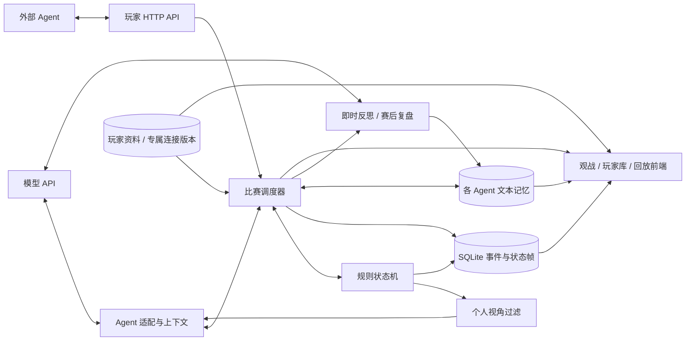

# 公共运行机制与数据流

[文档导航](README.md) · [多游戏插件架构](MULTIGAME_ARCHITECTURE.md)

本页说明四款游戏共用的调度、事务、交流、经验与前端逻辑。各游戏插件维护自己的状态和规则，三国杀专有的实现会在文中注明。

## 规则与持久化

规则层无网络、定时器、数据库或模型依赖，状态可以序列化为 JSON。每个插件通过 `legalActions()` 提供当前玩家的合法操作，通过 `apply()` 拒绝非法或过期选择后执行规则。

三国杀的 `tasks` 队列表示尚未解决的响应与规则动作，`advance()` 自动推进到下一处玩家选择。弃牌使用带数量和候选牌的模板，一次选完，避免组合枚举；每次合法动作后检查 108 张牌守恒及区域独占。棋类和狼人杀使用自己的棋局/阶段状态，不依赖这套任务队列。

存储层按事件序号保存压缩状态，动作结束另保存可继续执行的检查点。状态稳定后写 `ready` 事件。回放恢复所选帧对应的插件实例；国际象棋还会重建走子历史，客户端不需要自行重演规则。服务启动时将运行中的未完成比赛恢复为暂停，保留三国杀的手牌/响应链、狼人杀的角色/待结算行动和棋局重复历史。

创建比赛时，玩家档案、座位令牌、首局状态和初始化事件在同一事务提交；后续新局也独立原子初始化。只有成功提交后才缓存引擎和通知界面，避免失败留下半成品比赛。

## 调度与 RSI

每场对战有一个调度 worker，按 `concurrency` 启动对局 worker，默认 1 个。同一局的各座位依照规则依次决策，`game_runs` 单独保存运行状态。等待外部 Agent 的局仍占用一个并行名额，其他局可以继续。单局出错不会停止其他局，恢复时仅重试未完成局。

有空闲名额时按局号创建新局，种子和座位轮换由局号决定，与完成先后无关。整场暂停会取消所有局的请求，并等待写入停止；单步可以指定 gameId。每个动作连同事件和检查点在一个 SQLite 事务内提交。事务失败后丢弃内存实例，恢复时重新加载已提交状态。

即时反思在动作提交后执行。决策记录保存是否需要反思及动作后的版本号；若反思期间暂停或退出，下次继续时先补完该版本的反思。完成标记包含 gameId 与 Agent ID。

赛后复盘按 Agent 逐个执行，完成后该局标记为 finished 并释放并行名额。所有计划局完成复盘后，整场比赛才结束。不同局可同时反思，结果通过独立事务写入对应 Agent 的经验。调用失败记录为错误，取消的反思不会标记为完成。

## 模型输入与交流

Agent 输入由 `view(seat)`、对应 `visibleHistory(seat)`、当前局可见对话及同游戏有效经验组成，序列化为文本 JSON。棋盘使用结构化数组，国际象棋还提供 FEN；不发送截图、全知隐藏状态、牌堆次序、随机种子或其他 Agent 的记忆。模型返回合法动作 ID，服务器重新校验；本地策略使用同样的可见输入。字段与坐标见 [API](API.md#外部-agent)。

交流通过决策结果中的可选 `speech` 字段实现，不另起聊天模型调用。引擎先验证版本和动作，再按频道写入 `chat` 事件，随后执行动作；发言与动作、决策记录、检查点处于同一事务。狼人夜间密谈带 `visibleTo` 座位列表，查验和药品信息同样过滤；公开聊天查询排除私密事件。消息的 Agent ID、姓名、座位与时机从当局状态生成。重试中未采用的响应、取消、非法动作或事务回滚不会产生发言。

聊天沿用事件存储，额外建立按局和序号查询聊天的局部索引，无需迁移旧状态 JSON。上下文将可见历史拆成牌局事件与聊天两条独立窗口：聊天最多默认 80 条，并受约 16000 字符的序列化预算约束。输入和省略计数一同存入决策日志，RSI 复盘同样可读取本局对话。聊天内容可能包含策略性误导，提示词将其与权威规则、真实观察区分。并行局的原始对话不共享，提炼成 RSI 经验后仍可按 Agent ID 与 gameType 复用。

前端聊天室分页读取指定序号之前的公开消息，以游戏 ID 和回放位置重置组件；请求取消标记避免切局后的旧响应覆盖新聊天室。实时视图以当前已加载状态的 revision 为消息上界，回放不会显示未来发言。历史聊天按事件序号分页，不受牌局动态列表的最近 300 条窗口影响。

## 经验与归纳

记忆存放在独立表中，按稳定 Agent ID 与 gameType 查询；同一游戏的中英文版本共享经验。事件和记忆输入都有长度预算，模型会收到总数、实际包含数和省略数。完整记录仍保留在数据库中。

原始经验通过 `game_id` 关联对战和局号，旧数据查询时即可分组；`memory_metadata` 为归纳经验补充对战与归纳任务 ID。`consolidations` 保存来源 ID、类型计数、当前玩家模型、运行进度及压缩调用记录。归纳按玩家和对战加锁，重复点击共享同一任务。所有来源经验先拍快照，按文本预算分块，再递归合并摘要，结果在单一事务中落盘。新增经验不在本次覆盖范围，原文被删除或修改则拒绝提交该摘要。服务关闭取消归纳；崩溃遗留的任务在重启时标记 interrupted。

归纳单批采用独立 180 秒超时及约 8000 字符的序列化经验预算。仅暂时性网络 / 超时 / HTTP 408、429、5xx 失败重试一次，等待可随服务关闭取消。有效批次保存摘要及模型连接、模型名、完整提示词的 SHA-256；再次发起失败 / 中断的任务时，从同一玩家同一场的最近任务读取匹配批次，原文和模型发生变化则不复用相应结果。失败尝试也记录输入、耗时与错误；复用次数与本次成功调用次数分别显示。缓存属于内部调用记录，不进入决策经验正文。

有效记忆由每场最新仍存在的归纳结果、尚未被其覆盖的原始经验以及手动经验组成，旧摘要和被覆盖原文仍可查阅。来源 ID 列表不进入每次模型决策上下文，避免长存档使输入膨胀。归纳使用玩家当前 API 配置，游戏决策和 RSI 仍使用对战创建时的连接版本。

## 导航与观战

首页为独立游戏大厅。三国杀观战页分为比赛列表、牌桌与历史；其他场地共用 `MultiGameArena` 的档案、棋盘/角色席位和详情面板。SSE 广播变更通知，共享页面刷新摘要；各观战组件另行轮询快照。回放固定事件序号，画面、事件和落子标记以加载帧为准，切帧期间不显示旧帧充当新状态。历史列表只拉取当前窗口，完整数据通过分页或导出获得。

URL 与本地存储记录各游戏的比赛、对局、回放位置和视角，切换页面时后台比赛继续运行。返回上一场会清空经验面板的玩家选择和草稿，防止误写到其他场次。操作与代码入口见[界面指南](ARENA_UI.md)。

## 玩家与连接版本

玩家库使用 `player_profiles` 保存可编辑资料，`game_players` 保存每一局的参与者、当时的名字、座次、身份和武将。创建比赛时从 `playerIds` 读取当前资料并编译为原有 `AgentConfig[]` 快照，之后编辑档案不修改已创建比赛。旧 `agents` 协议仍可用，首次出现的 ID 自动建立档案；启动迁移补齐历史参与关系及只拥有经验的旧 Agent。

专属 API 的鉴权信息只在 `player_providers` 中保存，每次修改建立不可变的新版本。玩家查询接口仅提供地址和 `hasApiKey`，比赛快照只保存版本 ID，调用时在后端解析对应连接；旧对局恢复时仍能使用原版本。共享 `.env` Provider 则继续在启动时读取。

## 三国杀动画

三国杀动画只消费 `action.data.visual` 中公开打出的卡牌及 `damage` / `heal` 事件。隐藏手牌选择和跳过操作不生成视觉牌面。前端按事件序号去重，测量实际玩家面板在牌桌中的坐标后播放 CSS 位移、目标轨迹与体力浮字。首次连接、切换对局及回放建立新基线；快速仿真的短批次重叠展示，并限制活跃效果数，防止动画积压妨碍实时观战。
