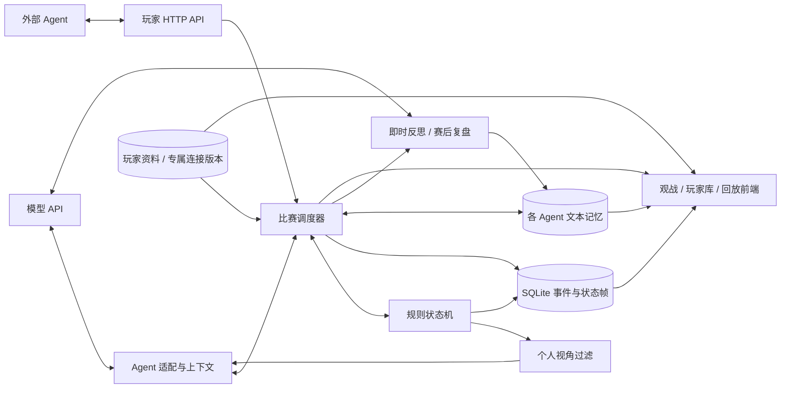

# 架构与数据流

规则层无网络、定时器、数据库或模型依赖。所有状态都是 JSON。`tasks` 队列表示尚未解决的响应与规则动作，`advance()` 自动推进到下一处玩家选择，`legalActions()` 提供合法操作，`apply(actionId, revision, cardIds?)` 拒绝伪造或过期选择后串行执行。弃牌使用带数量和候选牌的模板，一次选完，避免组合枚举。每次合法动作后检查 108 张牌守恒及区域独占。

存储层按原子事件序号保存压缩状态，动作结束另保存可继续执行的检查点。状态稳定后写 `ready` 事件，因此最新回放帧包含与实时游戏一致的响应队列。客户端不需要重演规则才能看旧帧。服务启动时将未结束比赛恢复为暂停，玩家手牌、随机数状态、响应链和摸牌顺序均保留。

每场对战有一个调度 worker，按 `concurrency` 启动独立的对局 worker，默认 1；同一局的各座位依照规则依次决策。`game_runs` 保存每局运行状态，与胜负结果分开。等待外部 Agent 的局占用一个并行名额，其他局继续；单局错误隔离，恢复时仅重试未完成局。新局按空闲名额依次创建，局号决定种子和座位轮换，不依赖完成先后。整场暂停取消全部局的请求并等待写入停止；单步支持指定当前 gameId。每个动作、事件流和检查点以 SQLite 事务提交，错误回滚后抛弃内存实例，恢复时重新加载已提交状态。

即时反思发生在动作已提交之后。决策记录包含是否需要即时反思和动作后的版本号；若暂停或退出发生在反思请求期间，下次继续时优先补完该版本的反思。完成标记包含 gameId 与 Agent ID。每局的轮次反思按 Agent 逐个执行，完成后该局标记为 finished 并释放并行名额；所有计划局完成复盘后整场才结束。不同局可同时反思，结果通过独立事务归入同一 Agent。失败明确记为模型调用错误，取消不标成完成。

模型只收到 `view(seat)` 和对应 `visibleHistory(seat)`，没有全知状态、牌堆、种子或其他 Agent 的记忆。模型返回一个合法动作 ID，服务器无需信任其对规则的解释。本地策略使用完全相同的输入，避免规则兜底获得额外信息。

公开聊天通过决策结果中的可选 `speech` 字段实现，不另起模型调用。`Engine.apply()` 先验证版本和动作，再将发言作为 `chat` 事件写入，随后执行动作；聊天帧保留原有响应队列，且处于与动作、决策记录、检查点相同的事务中。消息的 Agent ID、姓名、座位与时机均从当局状态生成。重试中未采用的响应、取消、非法动作或事务回滚不会产生公开发言。

聊天沿用事件存储，额外建立按局和序号查询聊天的局部索引，无需迁移旧状态 JSON。上下文将可见历史拆成牌局事件与聊天两条独立窗口：聊天最多默认 80 条，并受约 16000 字符的序列化预算约束。输入和省略计数一同存入决策日志，RSI 复盘同样可读取本局对话。聊天内容可能包含策略性误导，提示词将其与权威规则、真实观察区分。并行局的原始对话不共享，提炼成 RSI 经验后仍可按 Agent ID 复用。

前端聊天室分页读取指定序号之前的公开消息，以游戏 ID 和回放位置重置组件；请求取消标记避免切局后的旧响应覆盖新聊天室。实时视图以当前已加载状态的 revision 为消息上界，回放不会显示未来发言。历史聊天按事件序号分页，不受牌局动态列表的最近 300 条窗口影响。

记忆是独立表，通过稳定 Agent ID 查询。为避免模型上下文无限增长，最近事件和记忆输入设有显式预算，并将总数、包含数及省略数告诉模型。完整历史与完整记忆始终留在数据库中。

原始经验通过 `game_id` 关联对战和局号，旧数据查询时即可分组；`memory_metadata` 为归纳经验补充对战与归纳任务 ID。`consolidations` 保存来源 ID、类型计数、当前玩家模型、运行进度及压缩调用记录。归纳按玩家和对战加锁，重复点击共享同一任务。所有来源经验先拍快照，按文本预算分块，再递归合并摘要，结果在单一事务中落盘。新增经验不在本次覆盖范围，原文被删除或修改则拒绝提交该摘要。服务关闭取消归纳；崩溃遗留的任务在重启时标记 interrupted。

归纳单批采用独立 180 秒超时及约 8000 字符的序列化经验预算。仅暂时性网络 / 超时 / HTTP 408、429、5xx 失败重试一次，等待可随服务关闭取消。有效批次保存摘要及模型连接、模型名、完整提示词的 SHA-256；再次发起失败 / 中断的任务时，从同一玩家同一场的最近任务读取匹配批次，原文和模型发生变化则不复用相应结果。失败尝试也记录输入、耗时与错误；复用次数与本次成功调用次数分别显示。缓存属于内部调用记录，不进入决策经验正文。

有效记忆由每场最新仍存在的归纳结果、尚未被其覆盖的原始经验以及手动经验组成，旧摘要和被覆盖原文仍可查阅。来源 ID 列表不进入每次模型决策上下文，避免长存档使输入膨胀。归纳使用玩家当前 API 配置，游戏决策和 RSI 仍使用对战创建时的连接版本。

前端主页面分为比赛列表、牌桌与历史。SSE 只广播变更通知，页面随后获取最新状态，避免在客户端长时间堆积完整帧。实时状态通过轮询兜底，回放使用同一观战组件并固定事件序号。历史列表只拉取当前窗口，完整数据通过分页或导出获得。

玩家库使用 `player_profiles` 保存可编辑资料，`game_players` 保存每一局的参与者、当时的名字、座次、身份和武将。创建比赛时从 `playerIds` 读取当前资料并编译为原有 `AgentConfig[]` 快照，之后编辑档案不修改已创建比赛。旧 `agents` 协议仍可用，首次出现的 ID 自动建立档案；启动迁移补齐历史参与关系及只拥有经验的旧 Agent。

专属 API 的鉴权信息只在 `player_providers` 中保存，每次修改建立不可变的新版本。玩家查询接口仅提供地址和 `hasApiKey`，比赛快照只保存版本 ID，调用时在后端解析对应连接；旧对局恢复时仍能使用原版本。共享 `.env` Provider 则继续在启动时读取。

动画只消费 `action.data.visual` 中公开打出的卡牌及 `damage` / `heal` 事件。隐藏手牌选择和跳过操作不生成视觉牌面。前端按事件序号去重，测量实际玩家面板在牌桌中的坐标后播放 CSS 位移、目标轨迹与体力浮字。首次连接、切换对局及回放建立新基线；快速仿真的短批次重叠展示，并限制活跃效果数，防止动画积压妨碍实时观战。
