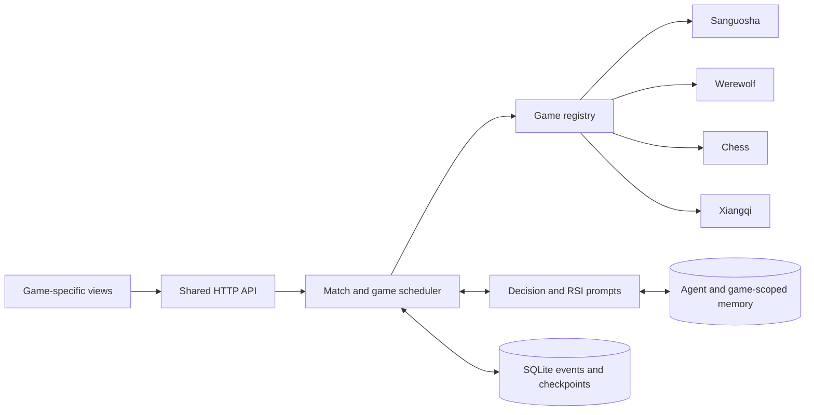

# 多游戏架构 / Multi-game architecture

[文档导航 / Documentation](README.md) · [运行机制](ARCHITECTURE.md) · [Adding a game](EXTENDING_GAMES.md)

当前实现：四种游戏共用运行层。设计目标是复用调度、交流、RSI 与持久化，同时让规则与视角留在各游戏插件内。

## 分层

1. `src/games/core.ts`：JSON 状态信封、玩家、观察、结果及 `GameEngine` / `GamePlugin` 契约。
2. `src/games/catalog.ts`：可供浏览器读取的游戏名称、人数、语言、规则版本。
3. `src/games/registry.ts`：创建、恢复、规则说明及本地策略的唯一分发入口。三国杀适配现有引擎，其余游戏使用独立状态类型。
4. `server/arena.ts`：公共比赛和对局调度器。插件仅接受经过合法性和 revision 校验的行动；调度器不解释游戏规则。
5. `server/store.ts`：共享事件帧、检查点、胜负、玩家和记忆。游戏结果保存获胜 Agent ID，避免使用三国杀身份推导所有游戏胜负。
6. 前端：`GameLobby.tsx` 提供独立游戏大厅与搜索，卡片由 `catalog.ts` 和 `game-presentation.ts` 驱动，`navigation.ts` 管理 hash 路由与各游戏观战状态；原三国杀牌桌保留，`MultiGameArena.tsx` 共享其他游戏的创建、控制、聊天、回放与 RSI 入口，`GameBoards.tsx` 分发棋盘/角色视图。

## 不变量

- 不传 gameType 的旧比赛默认三国杀，旧状态可恢复；游戏选择与语言在创建比赛时固定。
- 插件状态包含序列化版本、语言及恢复所需全部信息，比赛配置另保存规则版本；恢复不得重新随机分配角色或丢失棋局重复历史。
- 外部 Agent 和模型通过同一可见观察接口行动。全知存档仅供实验观察者，不作为 Agent 输入。
- 狼人夜间讨论仅对狼人可见；预言家结果、女巫信息及未公开投票不泄露给其他玩家。
- 比赛创建（玩家档案、座位令牌、首局）及后续新局初始化均在事务中完成；提交后才缓存引擎和通知界面。每次行动、聊天、状态帧与检查点原子提交；过期和非法行动不产生发言。
- 经验按稳定 Agent ID 与 gameType 隔离；旧手动经验默认三国杀。归纳继承来源对战的游戏与语言。
- 结果使用独立 winners / draw 字段；死亡队员仍可能随阵营获胜。

## 新游戏接入步骤

新增插件状态、规则引擎、可见观察、合法动作、恢复、本地策略与双语规则（若适用）；注册元信息与工厂；新增前端 renderer；通过规则、信息隔离、恢复、聊天、RSI 和运行集成测试。无需复制调度器、数据库或模型客户端。

## Language

`locale` is a match-level setting (`zh` or `en`). Werewolf and chess localize game controls, rule text, decisions, chat instructions and RSI prompts. Xiangqi and the legacy Sanguosha environment use Chinese. Protocol IDs remain language-neutral.

## Data flow

## Compatibility and operational details

`GameEngine` exposes only shared state and observation fields; each engine retains its own concrete state. The original `src/types.ts` card types remain available to the Sanguosha renderer and existing integrations. `BaseEngine` is optional, allowing existing engines to be adapted structurally.

Every accepted decision is committed together with its events, speech and checkpoint. Generic terminal outcomes use `game_outcomes`; Sanguosha archives retain their original role-based calculation. Manual/imported scopes use `memory_scopes`, while game-generated and consolidated scopes derive from the source match. These are additive SQLite tables; no old checkpoint rewriting is required.

The observer interface intentionally includes privileged replay/export access. Agent integrations must use seat tokens and filtered context endpoints, as before. Wolves use explicit audience seat lists for private events, and public chat queries exclude those events.

See [extension checklist](EXTENDING_GAMES.md) and [game-specific rule boundaries](games/README.md).

Existing installations: [migration and rollback notes](MIGRATION.md).

## Frontend navigation and rendering

The root URL and `#/lobby` show the game collection; game workspaces contain only a lobby return entry, so adding games does not consume header space. The lobby renders catalog entries as a wrapping grid and searches Chinese/English names. `#/arena/:gameType?match=…&game=…&frame=…&viewer=…` represents the visible workspace. Game/match/round selection pushes browser history; timeline and perspective changes replace the current entry. Per-game local storage is a convenience fallback, while explicit URL parameters take precedence. Storage contains IDs and view preferences, never API keys or Agent tokens. Unavailable storage does not prevent navigation.

Switching games unmounts the old multi-game observer and cancels its pending UI updates; it does not pause or stop the server-side match. Each fetch is scoped to game, frame and perspective, and the renderer hides snapshots whose identity does not match the current selection. Missing saved matches fall back to an available match of the selected game. Creation refreshes the archive before selecting the returned match and guards against older in-flight archive reads.

Chess/Xiangqi board flipping is presentation-only. Highlighted moves come from events no later than the displayed revision. Werewolf role cards use only the selected observation; unknown identities are not inferred by the UI. Public communication, event history and per-game RSI memories have separate inspector tabs. See [the UI guide](ARENA_UI.md) and `tests/e2e/navigation.spec.ts`.
