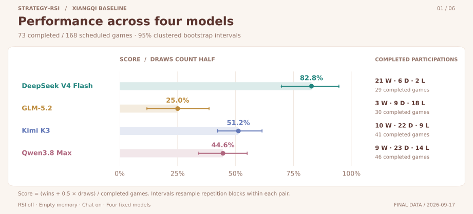
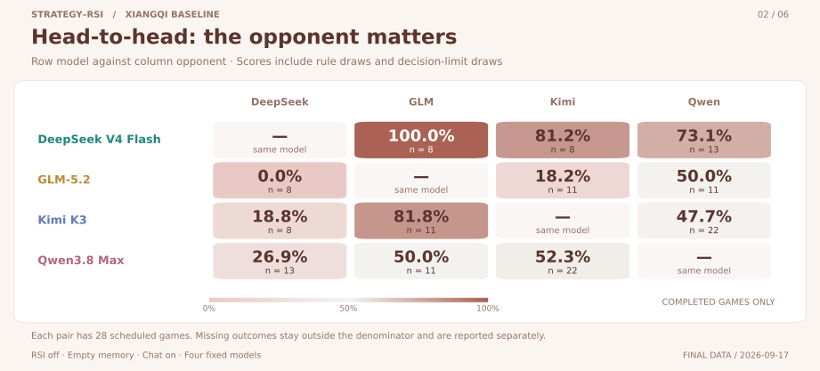
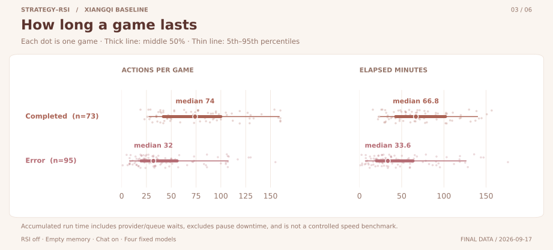
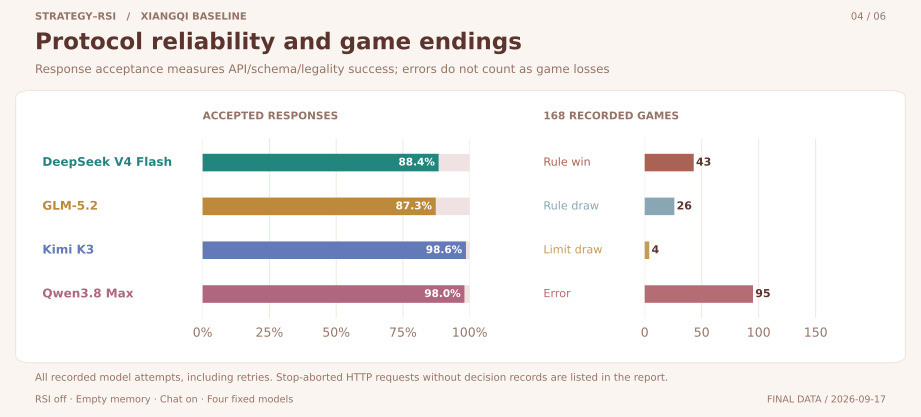
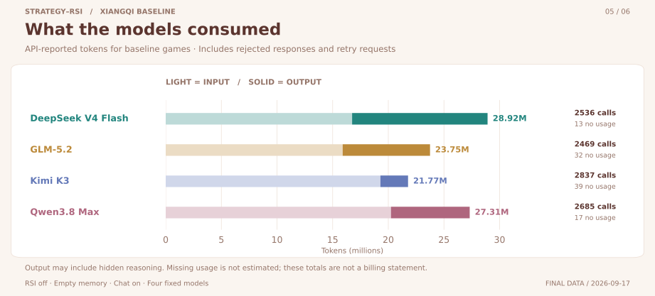
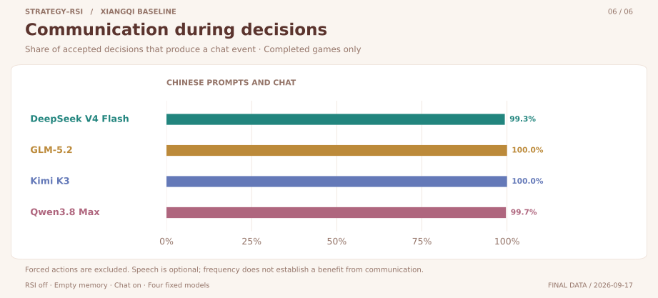

# 中国象棋四模型基线实验

[项目首页](../../README.md#基线实验) · [实验索引](../README.md) · [English](README.en.md) · [results.json](results.json) · [analysis.json](analysis.json) · [plan.json](plan.json)

中国象棋基线共安排 **168 局**：原始 24 局加上本次扩展的 144 局，最终 73 局完成、95 局异常。计入此前试跑和功能验证后，共运行 175 局，上限为 200 局。异常局保留在记录中，没有补跑替换。

## 实验设置与场数

6 组模型配对 × 2 种执色 × 14 次重复 = 168 局，仅中文。

所有对局都从标准初始棋盘开始，`seed=42` 不会改变开局。重复对局用于观察模型在相同起点下的响应差异，未测试其他初始局面。每模型安排 84 局，先后手各 42 局。

| 项目                 | 设置                                                                               |
| -------------------- | ---------------------------------------------------------------------------------- |
| 模型                 | `bailian/deepseek-v4-flash`<br>`glm-5.2`<br>`kimi-k3`<br>`qwen3.8-max-0902`        |
| 规则版本             | arena-v1                                                                           |
| 语言                 | 中文                                                                               |
| 交流与经验           | 交流开启；每次决策传入空经验；RSI 关闭                                             |
| 上下文               | 最近 80 条可见事件、40 条可见聊天；生产决策提示词与协议                            |
| 采样与输出（请求值） | temperature=0.6; reasoning_effort=low; max_tokens=8192                             |
| 超时与重试           | 180 秒；每次决策最多 2 次已记录尝试；暂停取消的请求另计；保留网关 400/422 兼容重试 |
| 行动上限             | 160                                                                                |
| 兜底与协议适配       | 无启发式兜底、无行动标签修正；无选择的强制行动可自动执行                           |
| 执行批次             | 原始：16 局 / 每模型 8 请求；新增：三游戏共享 96 局 / 每模型 24 请求上限           |

| 用途                    | 局数      | 是否计入模型表现 |
| ----------------------- | --------- | ---------------- |
| 正式基线                | 168       | 是；异常单列     |
| 4,096 Token 试跑        | 3         | 否               |
| 原 4,096 Token 功能验证 | 2         | 否，含中断       |
| 8,192 Token 功能验证    | 2         | 否               |
| 实际总数 / 上限         | 175 / 200 |                  |

扩展启动时，类型检查发现运行脚本的鉴权错误分支重复使用了一个路径变量名。暂停修复后，从原检查点继续，未重建或替换对局。暂停时取消的 HTTP 请求仍记入用量账本，缺失的 usage 未作估算。修订和旧版脚本快照见 [amendments.json](amendments.json)。

## 结果图表

### 1. 模型积分率

[](assets/win-rate.svg)

在已完成的对局中，DeepSeek 的点估计最高，为 82.8%，95% 分组区间为 69.7%–94.6%。失败局被排除后，样本可能存在选择偏差；仅凭此图不能确定模型排名的统计显著性。

### 2. 两两交锋

[](assets/head-to-head.svg)

行模型对列模型，和棋计半分；每对模型计划 28 局，格子标明实际完成局数。

### 3. 对局长度

[](assets/game-duration.svg)

完成与异常分别展示行动数和累计运行时长。点为对局，粗线为四分位区间，细线为 5%–95% 分位数。

### 4. 协议可靠性与结局

[](assets/reliability.svg)

规则胜负 43、规则和棋 26、行动上限平局 4、异常 95。异常局没有胜负结果，不计入模型败局。

### 5. Token 消耗

[](assets/token-use.svg)

正式基线记录 10527 次 HTTP 请求；输入 72,177,985 Token、输出 29,576,842 Token，101 次请求缺少 usage。

### 6. 模型交流频率

[](assets/chat-frequency.svg)

统计完成局中模型决策附带发言的比例，排除强制行动。发言取自决策产生的公开聊天事件。

## 分母、语言与批次

| 模型     | 胜 / 和 / 负 | 完成参与数 | 点估计 | 95% 分组区间 | 缺失结果极端界限 |
| -------- | ------------ | ---------- | ------ | ------------ | ---------------- |
| DeepSeek | 21/6/2       | 29         | 82.8%  | 69.7%–94.6%  | 28.6%–94.0%      |
| GLM      | 3/9/18       | 30         | 25.0%  | 11.8%–38.6%  | 8.9%–73.2%       |
| Kimi     | 10/22/9      | 41         | 51.2%  | 42.2%–61.4%  | 25.0%–76.2%      |
| Qwen     | 9/23/14      | 46         | 44.6%  | 34.1%–55.0%  | 24.4%–69.6%      |

缺失结果极端界限分别假设所有失败参与得 0 分或 1 分，再除以全部排程参与数，用于显示未完成结果可能造成的范围；它不是置信区间。

积分率为 `(胜 + 0.5 × 和) / 完成参与数`，只使用该模型完成的对局。胜率则为胜场除以完成参与数。

| 语言 | 排程 | 完成 | 异常 | DeepSeek     | GLM          | Kimi         | Qwen         |
| ---- | ---- | ---- | ---- | ------------ | ------------ | ------------ | ------------ |
| zh   | 168  | 73   | 95   | 82.8% (n=29) | 25.0% (n=30) | 51.2% (n=41) | 44.6% (n=46) |

| 批次               | 排程 | 完成 | 异常 | DeepSeek     | GLM          | Kimi         | Qwen         |
| ------------------ | ---- | ---- | ---- | ------------ | ------------ | ------------ | ------------ |
| initial-20260916   | 24   | 12   | 12   | 62.5% (n=4)  | 70.0% (n=5)  | 60.0% (n=5)  | 30.0% (n=10) |
| extension-20260917 | 144  | 61   | 83   | 86.0% (n=25) | 16.0% (n=25) | 50.0% (n=36) | 48.6% (n=36) |

两批实验的规则、提示词和决策参数相同，但运行日期、网关负载和并发不同。本游戏只测试中文；批次表用于描述结果，不能据此推断并发的影响。

| 完成局结算原因     | 局数 |
| ------------------ | ---- |
| 三次重复局面       | 26   |
| 认输               | 24   |
| 将死               | 14   |
| 达到配置的决策上限 | 4    |
| 困毙               | 4    |
| 单方长将判负       | 1    |

## 统计方法与解释边界

先按模型配对分层，再在每对模型内部重采样重复组。每对 14 组，同组的两种执色不拆开。固定随机种子 20260917，进行 20,000 次 bootstrap；每次重新计算完成样本的指标，取 2.5% 与 97.5% 分位数。异常局随整组重采样，但不进入完成分母。

区间仅描述完成样本，未校正选择性失败或多重比较。实验只使用标准初始局面和有限次重复，无法据此判断其他开局或模型版本的表现。达到行动上限记为实验性平局，与规则和棋单独统计。

基线关闭 RSI，每次决策传入空经验，因此没有测量学习收益。交流频率只记录发言多少，不能说明发言质量或交流是否提高胜率。

累计运行时长包含服务等待、请求排队和存档开销，并扣除暂停期间进程未运行的时间。它反映本次运行的耗时，不能直接用于比较模型速度。

## 调用失败与功能验证

| 模型     | 决策尝试 | 通过 | 拒绝 | Token 截断 | 非法行动 | 标签当 ID | 终止对局 |
| -------- | -------- | ---- | ---- | ---------- | -------- | --------- | -------- |
| DeepSeek | 2525     | 2231 | 294  | 291        | 1        | 0         | 44       |
| GLM      | 2462     | 2149 | 313  | 221        | 67       | 0         | 41       |
| Kimi     | 2833     | 2793 | 40   | 0          | 4        | 0         | 2        |
| Qwen     | 2677     | 2624 | 53   | 0          | 43       | 0         | 8        |

一局需要连续完成多次决策，任何一步的两次尝试都失败就会终止，所以单次响应通过率高也未必能完成整局。表中“终止对局”归给最后一次决策失败的模型，用于定位协议问题，不计作败局。

“标签当 ID”指模型把合法行动的显示文字填进了 ID 字段。这些响应属于被拒绝的动作，因此各错误列有重叠，不能直接相加。基线中的失败决策不会由本地策略补走。逐次拒绝原因见 `games[].rejections`。

HTTP 账本比保存的决策尝试多 30 条，来自协议兼容重试或暂停时取消的请求等。一次决策可能发送多个请求，请求数与对局数分别统计。

另以 8,192 Token 输出额度运行了 2 局功能验证，其中 0 局通过全部检查，记录 1 次兜底行动和 4 条调用错误，归纳成功 4 / 4。验证的行动上限为 20，用于检查短局流程，不计入上面的模型表现。

| 验证对局                | 全项通过 | 即时 RSI | 赛后 RSI | 归纳成功 | 兜底 | 调用错误 |
| ----------------------- | -------- | -------- | -------- | -------- | ---- | -------- |
| validation-xiangqi-zh-0 | False    | 20       | 2        | 2/2      | 1    | 3        |
| validation-xiangqi-zh-1 | False    | 19       | 2        | 2/2      | 0    | 1        |

审计复核了 85 份已保存上下文，检查可见信息、提示词语言和经验所属游戏，并验证存档恢复与 HTTP 回放。35 次决策读取了已有经验，其中 0 次读取了归纳经验。

错误调用若未保存输入，就无法核查其上下文。最初 4,096 Token 试跑与验证中的失败和中断仍保存在 `pilot`、`originalValidation` 中。

## 用量与数据审计

| 用途                  | HTTP 请求 | 有 usage | 输入 Token | 输出 Token |
| --------------------- | --------- | -------- | ---------- | ---------- |
| baseline              | 10527     | 10426    | 72,177,985 | 29,576,842 |
| pilot4096             | 23        | 21       | 68,775     | 33,086     |
| validation4096        | 72        | 70       | 276,655    | 106,278    |
| validation8192        | 90        | 90       | 393,808    | 133,338    |
| consolidationRecovery | 0         | 0        | 0          | 0          |

Token 按供应商返回的 usage 统计，输出量可能包含不可见的推理。缺失 usage，以及最初验证中断时尚未写入的在途请求，均未补估。四模型连通性探测和输出额度诊断没有创建对局，作为共享请求记录，不分摊到单个游戏。

离线审计从每局初始状态重放了 9797 个行动，检查 10497 份模型输入的可见信息和空经验，并核对最终状态。全部 168 局通过审计。

审计和绘图不调用模型。原始输入、响应与检查点保存在本地 `artifacts/`；公开文件提供摘要和完整行动历史，不含 API 密钥。

## 文件与复现

| 文件                                                                                  | 内容                                                            |
| ------------------------------------------------------------------------------------- | --------------------------------------------------------------- |
| [results.json](results.json)                                                          | 逐局摘要、语言与批次结果、调用与 RSI 检查                       |
| [analysis.json](analysis.json)                                                        | 分组区间、缺失界限、矩阵和时长统计                              |
| [games-history.json.gz](games-history.json.gz)                                        | 全知研究历史：角色、行动、理由、私聊和最终状态；不是 Agent 输入 |
| [config.example.yaml](../_shared/config.example.yaml)                                 | 共用配置示例，不含密钥；EXPERIMENT_ENV 指定私有配置路径         |
| [plan.json](plan.json) · [amendments.json](amendments.json)                           | 固定排程、场数预算、协议、源码哈希与修订                        |
| [provenance.json](provenance.json) · [source-snapshot.tar.gz](source-snapshot.tar.gz) | 数据与源码校验；旧运行器也保留在快照中                          |
| [provenance/](provenance/)                                                            | 该游戏原始 24 局计划和试跑记录                                  |
| [共享历史源码](../_shared/provenance/)                                                | 三款游戏共用的原始源码快照、验证运行时、零对局诊断与校验清单    |
| [assets/](assets/)                                                                    | 六张 SVG 与同尺寸 PNG，及生成来源清单                           |

在仓库根目录，仅用公开 JSON 重算分析和图表：

```bash
python3 -m venv .venv-exp
. .venv-exp/bin/activate
pip install -r exp/_shared/requirements.txt
python3 exp/reproduce.py xiangqi
```

统一入口 [reproduce.py](../reproduce.py) 依次生成分析、图表和报告，也可在游戏名后加 `analyze`、`figures` 或 `report` 只运行一步。实现位于 [../\_shared/](../_shared/)，数据和输出仍保存在本游戏目录。图表参考 [三国杀](../sanguosha/README.md) 的卡片版式，提供 2816 × 1276 PNG 和 SVG。

本地保留完整原始实验目录时，可离线重新导出并审计本游戏：

```bash
npx tsx scripts/export-game-results.ts --game xiangqi
```

公开数据、场数、历史、分母与图表哈希的独立检查：

```bash
python3 scripts/experiments/verify_studies.py
```

运行实验使用 [run-game-baselines.ts](../../scripts/run-game-baselines.ts)，它从指定 `.env` 读取 `api_key_env_yh` 并调用付费 API。加 `--check` 时只检查排程与本地规则。续跑使用原游戏 ID 和检查点，跳过已结束局，每游戏最多 200 局。

重新执行实验还需要本地历史账本 `artifacts/multigame-20260916/public-archive/`。查看报告、重算公开统计或绘图都不需要这份账本。

读取公开历史示例：

`games-history.json.gz` 是 gzip 压缩的 JSON，包含全部 168 局正式基线（包括异常局），每局保存 `players`、`actions`、`events` 和 `finalState`。聊天保存在 `events` 中的 `chat` 事件里，公开发言和队内密谈均保留原可见性标记。试跑与 RSI 验证在 `results.json` 中保留摘要，完整输入和响应留在本地 `artifacts/`。

```python
import gzip, json
with gzip.open("exp/xiangqi/games-history.json.gz", "rt", encoding="utf-8") as f:
    history = json.load(f)
print(len(history["games"]))
game = history["games"][0]
print(game["job"])
chat = [event for event in game["events"] if event["type"] == "chat"]
print(len(game["actions"]), len(chat))
```
